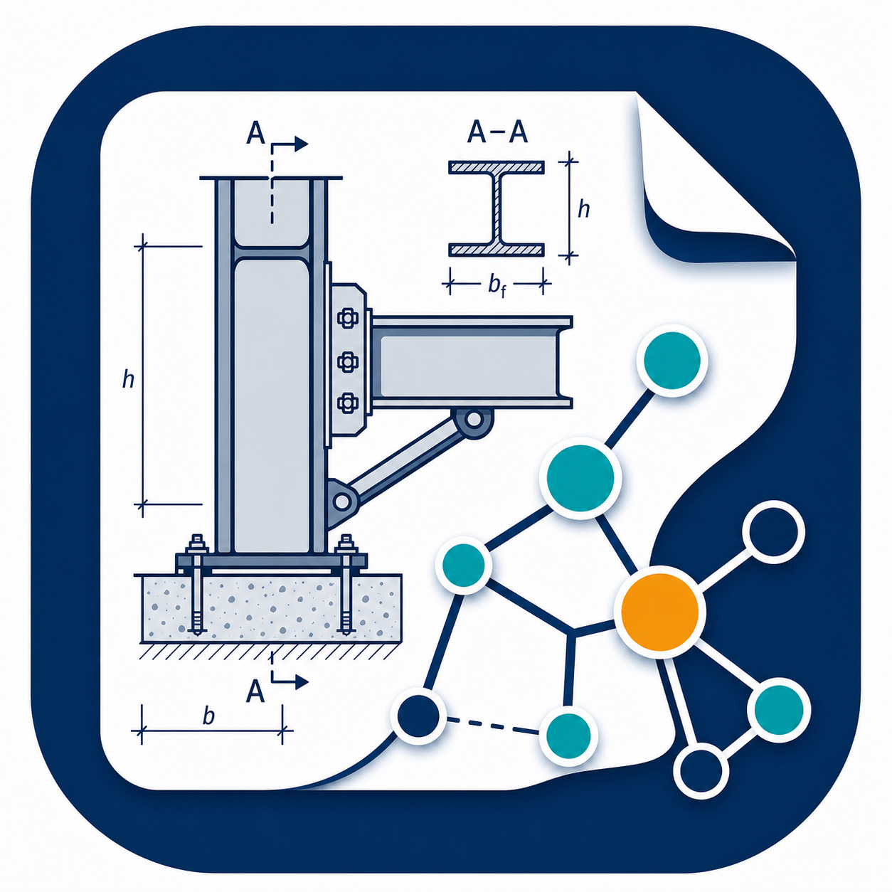

# AEC Drawing Ontologies

<p align="center">
  
</p>

ADIRO (*AEC Drawing Information Representation Ontologies*) is a set of ontologies for AEC (*Architecture, Engineering, and Construction*) drawing representation, designed to support machine learning tasks, in particular information extraction workflows.

The ontologies include concepts for drawing metadata, common symbols, domain-common symbols, and domain-specific symbols. They can be used to represent the information in AEC drawings, to make them machine-readable, and to support the creation of graph databases and knowledge graphs.

## Documentation

Find the docs here: https://burohappoldmachinelearning.github.io/ADIRO/.

The documentation site is built with **[Material for MkDocs](https://squidfunk.github.io/mkdocs-material/)** and deployed to GitHub Pages whenever:
- Changes are pushed to the `main` or `master` branch
- The workflow is manually triggered from the GitHub Actions tab

The site provides a landing page (`docs/index.md`), a **Use Cases** page (`docs/uc-orsd/README.md`), an **Ontology Requirements (ORSD)** page (`docs/ORSD_v1.1.md`), and a detailed per-ontology reference page for each ontology, generated with **[pyLODE](https://github.com/RDFLib/pyLODE)**.

### How it fits together

- `scripts/generate_docs.py` reads every `.ttl` in `src/`, generates a pyLODE HTML reference page for each into `docs/`, copies the `.ttl` and `*.display.json` sources into `docs/`, and (re)generates the MkDocs landing page `docs/index.md` (including the auto-discovered list of ontologies).
- `mkdocs.yml` configures the Material site. It uses `docs/` as its source directory, so the generated pyLODE HTML pages, the `.ttl` sources, and the `.display.json` files are copied verbatim into the built site alongside the Markdown pages.
- The site is built into `site/` (git-ignored) and deployed to GitHub Pages.

### Preview the site locally

To view the documentation site on your machine with live reload:

```bash
# 1. Install dependencies (once)
uv sync

# 2. Generate the pyLODE ontology pages + the MkDocs landing page (docs/index.md)
uv run python scripts/generate_docs.py

# 3. Start the live-reloading preview server
uv run mkdocs serve
```

Then open **http://127.0.0.1:8000/ADIRO/** in your browser. The server rebuilds automatically whenever you edit a file under `docs/` or `mkdocs.yml`.

> Tip: to serve on a different address/port, use e.g. `uv run mkdocs serve -a localhost:8001`.

### Building the static site

To produce the deployable static site (what CI publishes to GitHub Pages):

<details>

```bash
uv run python scripts/generate_docs.py   # regenerate ontology pages + index.md
uv run mkdocs build                       # outputs the static site into site/
```

Each `.ttl` file in `src/` gets a corresponding `.html` reference page in `docs/`, and any `*.display.json` files are copied to `docs/` for public access via GitHub Pages. The final static site is produced in `site/` (git-ignored).

</details>

## Contributing

Contributions are welcome — please propose additions or changes as a
**[GitHub issue](https://github.com/BuroHappoldMachineLearning/ADIRO/issues)**.

See the **[Contribute](https://burohappoldmachinelearning.github.io/ADIRO/contribute/)** section of the documentation site for details:

- **[Adding New Ontologies](https://burohappoldmachinelearning.github.io/ADIRO/contribute/adding-ontologies/)** — how to add a new `.ttl` and have it documented automatically.
- **[Versioning](https://burohappoldmachinelearning.github.io/ADIRO/contribute/versioning/)** — versioned/unversioned IRIs, version backups, and how to cut a new version.
- **[Design Decisions](https://burohappoldmachinelearning.github.io/ADIRO/contribute/design-decisions/)** — rationale behind OWL restrictions, annotation properties, and relationship modelling.
