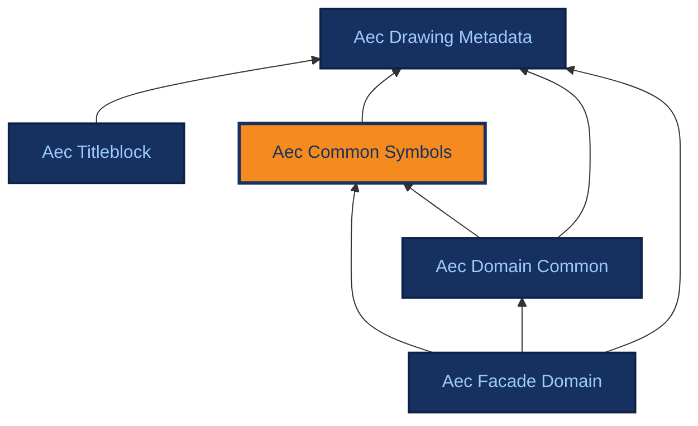

# Aec Common Symbols

[{ .ontocanvas-icon } Open in OntoCanvas](https://alelom.github.io/OntoCanvas/?onto=https://burohappoldmachinelearning.github.io/ADIRO/aec_common_symbols.html){ .md-button target=_blank }
[:material-file-document-outline: TTL source](https://burohappoldmachinelearning.github.io/ADIRO/aec_common_symbols.ttl){ .md-button }
[:material-file-code: pyLODE HTML](https://burohappoldmachinelearning.github.io/ADIRO/aec_common_symbols.html){ .md-button }

Cross-discipline layout content. Generic symbol classes like dimensions, reference symbols, grids, etc. (mostly reusable non-domain symbols). All symbols are subclasses of DrawingElement from the drawing metadata ontology.

- **IRI:** `https://w3id.org/adiro/aec_common_symbols`
- **Version:** 2.0.0
- **Imports:** `aec_drawing_metadata`

## Dependencies

Arrows point from an ontology to the ontologies it imports; the current ontology is highlighted.

## Classes

### Dimension {#Dimension}

A dimension line or dimension annotation on a drawing, indicating measurements or distances.

- **IRI:** `https://w3id.org/adiro/aec_common_symbols#Dimension`
- **Sub class of:** `metadata:DrawingElement`

### Grid {#Grid}

A grid line or grid system used for alignment and reference in architectural drawings.

- **IRI:** `https://w3id.org/adiro/aec_common_symbols#Grid`
- **Sub class of:** `metadata:DrawingElement`

### ReferenceSymbol {#ReferenceSymbol}

A symbol drawn on a Layout that references another Layout (on the same or a different DrawingSheet). Replaces the earlier Callout class. Typical instances include Detail Markers, Section Markers, and Elevation Markers. The marker type is not modelled — it is derivable from the target Layout's LayoutContentType.

- **IRI:** `https://w3id.org/adiro/aec_common_symbols#ReferenceSymbol`
- **Sub class of:** `metadata:DrawingElement`

## Object Properties

### appearsOn {#appearsOn}

Source Layout — the Layout on which this ReferenceSymbol is drawn.

- **IRI:** `https://w3id.org/adiro/aec_common_symbols#appearsOn`
- **Domain:** [ReferenceSymbol](#ReferenceSymbol)
- **Range:** `metadata:Layout`
- **Inverse of:** [hasReferenceSymbol](#hasReferenceSymbol)

### hasReferenceSymbol {#hasReferenceSymbol}

Inverse of appearsOn. A Layout contains one or more ReferenceSymbols.

- **IRI:** `https://w3id.org/adiro/aec_common_symbols#hasReferenceSymbol`
- **Sub property of:** `metadata:contains`
- **Domain:** `metadata:Layout`
- **Range:** [ReferenceSymbol](#ReferenceSymbol)

### isReferencedBy {#isReferencedBy}

Inverse of referencesLayout. A Layout that is the target of one or more ReferenceSymbols.

- **IRI:** `https://w3id.org/adiro/aec_common_symbols#isReferencedBy`
- **Domain:** `metadata:Layout`
- **Range:** [ReferenceSymbol](#ReferenceSymbol)

### referencesLayout {#referencesLayout}

Target Layout — the Layout this ReferenceSymbol points to. The target is Layout-level, not DrawingSheet-level.

- **IRI:** `https://w3id.org/adiro/aec_common_symbols#referencesLayout`
- **Domain:** [ReferenceSymbol](#ReferenceSymbol)
- **Range:** `metadata:Layout`
- **Inverse of:** [isReferencedBy](#isReferencedBy)
