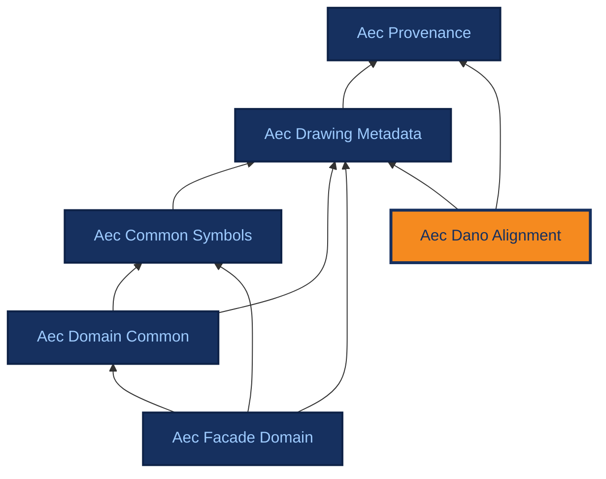

# Aec Dano Alignment

[{ .ontocanvas-icon } Open in OntoCanvas](https://alelom.github.io/OntoCanvas/?onto=https://burohappoldmachinelearning.github.io/ADIRO/aec_dano_alignment.html){ .md-button target=_blank }
[:material-file-document-outline: TTL source](https://burohappoldmachinelearning.github.io/ADIRO/aec_dano_alignment.ttl){ .md-button }
[:material-file-code: pyLODE HTML](https://burohappoldmachinelearning.github.io/ADIRO/aec_dano_alignment.html){ .md-button }

OPTIONAL compatibility layer mapping ADIRO terms to the Drawing Analysis Ontology (DAnO, https://w3id.org/dano). Nothing in the ADIRO core imports this module and no ADIRO core module mentions DAnO, so a consumer who wants the DAnO crosswalk loads this file explicitly and everyone else never sees it. Every mapping is annotation-level (skos:closeMatch) and carries no logical force: no rdfs:subPropertyOf alignment to a DAnO term is available, and the DAnO IRIs are not declared here or anywhere else in ADIRO. Kept separate from the core for lifecycle reasons - DAnO has no releases, and an unreleased third-party vocabulary should not force a version bump on a module downstream consumers pin. Full rationale and per-term verdicts: https://burohappoldmachinelearning.github.io/ADIRO/design-decisions/dano-comparison/

- **IRI:** `https://w3id.org/adiro/aec_dano_alignment`
- **Version:** 1.0.0
- **Imports:** `aec_drawing_metadata`, `aec_provenance`
## Dependencies

Arrows point from an ontology to the ontologies it imports; the current ontology is highlighted.

