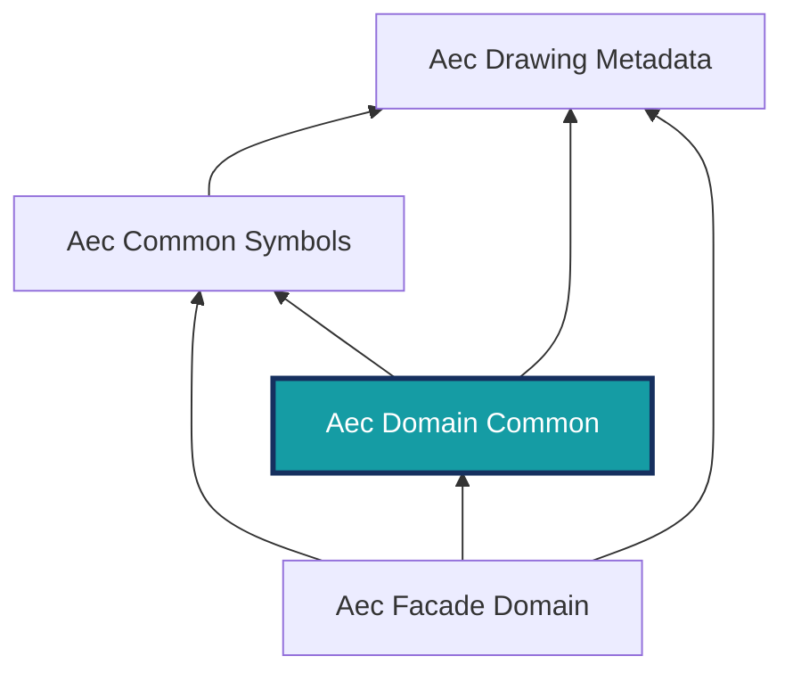

# Aec Domain Common

[{ .ontocanvas-icon } Open in OntoCanvas](https://alelom.github.io/OntoCanvas/?onto=https://burohappoldmachinelearning.github.io/ADIRO/aec_domain_common.html){ .md-button target=_blank }
[:material-file-document-outline: TTL source](https://burohappoldmachinelearning.github.io/ADIRO/aec_domain_common.ttl){ .md-button }
[:material-file-code: pyLODE HTML](https://burohappoldmachinelearning.github.io/ADIRO/aec_domain_common.html){ .md-button }

Shared domain abstractions reused across multiple domain ontologies (e.g., facade+structural).

- **IRI:** `https://burohappoldmachinelearning.github.io/ADIRO/aec_domain_common`
- **Version:** 1.0.0
- **Imports:** `aec_common_symbols`, `aec_drawing_metadata`

## Dependencies

Arrows point from an ontology to the ontologies it imports; the current ontology is highlighted.

## Classes

### Aluminium {#Aluminium}

- **IRI:** `https://burohappoldmachinelearning.github.io/ADIRO/aec_domain_common#Aluminium`
- **Sub class of:** [Material](#Material)

### Architectural {#Architectural}

- **IRI:** `https://burohappoldmachinelearning.github.io/ADIRO/aec_domain_common#Architectural`
- **Sub class of:** [Discipline](#Discipline)

### Asymmetrical {#Asymmetrical}

- **IRI:** `https://burohappoldmachinelearning.github.io/ADIRO/aec_domain_common#Asymmetrical`
- **Sub class of:** [Symmetry](#Symmetry)

### Beam {#Beam}

- **IRI:** `https://burohappoldmachinelearning.github.io/ADIRO/aec_domain_common#Beam`
- **Sub class of:** [Structural member](#StructuralMember)

### Brick {#Brick}

- **IRI:** `https://burohappoldmachinelearning.github.io/ADIRO/aec_domain_common#Brick`
- **Sub class of:** [Facing material](#FacingMaterial)

### Cable {#Cable}

- **IRI:** `https://burohappoldmachinelearning.github.io/ADIRO/aec_domain_common#Cable`
- **Sub class of:** [Linear structural component](#LinearStructuralComponent)

### Channel (section) {#SectionChannel}

- **IRI:** `https://burohappoldmachinelearning.github.io/ADIRO/aec_domain_common#SectionChannel`
- **Sub class of:** [Section shape](#SectionShape)

### Chord/bracing {#ChordBracing}

- **IRI:** `https://burohappoldmachinelearning.github.io/ADIRO/aec_domain_common#ChordBracing`
- **Sub class of:** [Structural member](#StructuralMember)

### CHS {#CHS}

- **IRI:** `https://burohappoldmachinelearning.github.io/ADIRO/aec_domain_common#CHS`
- **Sub class of:** [Section shape](#SectionShape)

### Circular {#Circular}

- **IRI:** `https://burohappoldmachinelearning.github.io/ADIRO/aec_domain_common#Circular`
- **Sub class of:** [Generic shape property](#GenericShapeProperty)

### Civil {#Civil}

Civil engineering discipline.

- **IRI:** `https://burohappoldmachinelearning.github.io/ADIRO/aec_domain_common#Civil`
- **Sub class of:** [Discipline](#Discipline)

### Clay {#Clay}

- **IRI:** `https://burohappoldmachinelearning.github.io/ADIRO/aec_domain_common#Clay`
- **Sub class of:** [Material](#Material)

### Column {#Column}

- **IRI:** `https://burohappoldmachinelearning.github.io/ADIRO/aec_domain_common#Column`
- **Sub class of:** [Structural member](#StructuralMember)

### Concrete {#Concrete}

- **IRI:** `https://burohappoldmachinelearning.github.io/ADIRO/aec_domain_common#Concrete`
- **Sub class of:** [Material](#Material)

### Dead load {#DeadLoad}

- **IRI:** `https://burohappoldmachinelearning.github.io/ADIRO/aec_domain_common#DeadLoad`
- **Sub class of:** [Structural properties](#StructuralProperties)

### Discipline {#Discipline}

The engineering or architectural discipline associated with a Layout.

- **IRI:** `https://burohappoldmachinelearning.github.io/ADIRO/aec_domain_common#Discipline`

### Electrical {#Electrical}

- **IRI:** `https://burohappoldmachinelearning.github.io/ADIRO/aec_domain_common#Electrical`
- **Sub class of:** [MEP](#MEP)

### Facade {#Facade}

- **IRI:** `https://burohappoldmachinelearning.github.io/ADIRO/aec_domain_common#Facade`
- **Sub class of:** [Architectural](#Architectural)

### Facing material {#FacingMaterial}

Can be standalone label - material used for facing

- **IRI:** `https://burohappoldmachinelearning.github.io/ADIRO/aec_domain_common#FacingMaterial`

### Fire life safety {#FireLifeSafety}

- **IRI:** `https://burohappoldmachinelearning.github.io/ADIRO/aec_domain_common#FireLifeSafety`
- **Sub class of:** [Architectural](#Architectural)

### Function {#Function}

- **IRI:** `https://burohappoldmachinelearning.github.io/ADIRO/aec_domain_common#Function`
- **Sub class of:** [Functional properties](#FunctionalProperties)

### Functional properties {#FunctionalProperties}

General property category

- **IRI:** `https://burohappoldmachinelearning.github.io/ADIRO/aec_domain_common#FunctionalProperties`

### Generic shape property {#GenericShapeProperty}

- **IRI:** `https://burohappoldmachinelearning.github.io/ADIRO/aec_domain_common#GenericShapeProperty`
- **Sub class of:** [Section properties](#SectionProperties)

### Geometric properties {#GeometricProperties}

General property category

- **IRI:** `https://burohappoldmachinelearning.github.io/ADIRO/aec_domain_common#GeometricProperties`

### Glass {#Glass}

- **IRI:** `https://burohappoldmachinelearning.github.io/ADIRO/aec_domain_common#Glass`
- **Sub class of:** [Material](#Material)

### I-section {#ISection}

- **IRI:** `https://burohappoldmachinelearning.github.io/ADIRO/aec_domain_common#ISection`
- **Sub class of:** [Section shape](#SectionShape)

### Lighting {#Lighting}

- **IRI:** `https://burohappoldmachinelearning.github.io/ADIRO/aec_domain_common#Lighting`
- **Sub class of:** [Electrical](#Electrical)

### Linear structural component {#LinearStructuralComponent}

- **IRI:** `https://burohappoldmachinelearning.github.io/ADIRO/aec_domain_common#LinearStructuralComponent`
- **Sub class of:** [Structural component](#StructuralComponent)

### Masterplan {#Masterplan}

- **IRI:** `https://burohappoldmachinelearning.github.io/ADIRO/aec_domain_common#Masterplan`
- **Sub class of:** [Discipline](#Discipline)

### Material {#Material}

- **IRI:** `https://burohappoldmachinelearning.github.io/ADIRO/aec_domain_common#Material`
- **Sub class of:** [Material properties](#MaterialProperties)

### Material properties {#MaterialProperties}

General property category

- **IRI:** `https://burohappoldmachinelearning.github.io/ADIRO/aec_domain_common#MaterialProperties`

### Mechanical {#Mechanical}

- **IRI:** `https://burohappoldmachinelearning.github.io/ADIRO/aec_domain_common#Mechanical`
- **Sub class of:** [MEP](#MEP)

### MEP {#MEP}

Mechanical, Electrical, and Plumbing.

- **IRI:** `https://burohappoldmachinelearning.github.io/ADIRO/aec_domain_common#MEP`
- **Sub class of:** [Discipline](#Discipline)

### Metal {#Metal}

- **IRI:** `https://burohappoldmachinelearning.github.io/ADIRO/aec_domain_common#Metal`
- **Sub class of:** [Material](#Material)

### Panel structural component {#PanelStructuralComponent}

- **IRI:** `https://burohappoldmachinelearning.github.io/ADIRO/aec_domain_common#PanelStructuralComponent`
- **Sub class of:** [Structural component](#StructuralComponent)

### Plumbing {#Plumbing}

- **IRI:** `https://burohappoldmachinelearning.github.io/ADIRO/aec_domain_common#Plumbing`
- **Sub class of:** [MEP](#MEP)

### Polycarbonate {#Polycarbonate}

- **IRI:** `https://burohappoldmachinelearning.github.io/ADIRO/aec_domain_common#Polycarbonate`
- **Sub class of:** [Material](#Material)

### Precast {#Precast}

- **IRI:** `https://burohappoldmachinelearning.github.io/ADIRO/aec_domain_common#Precast`
- **Sub class of:** [Material](#Material)

### Rectangular {#Rectangular}

- **IRI:** `https://burohappoldmachinelearning.github.io/ADIRO/aec_domain_common#Rectangular`
- **Sub class of:** [Generic shape property](#GenericShapeProperty)

### Restraint {#Restraint}

- **IRI:** `https://burohappoldmachinelearning.github.io/ADIRO/aec_domain_common#Restraint`
- **Sub class of:** [Structural properties](#StructuralProperties)

### RHS {#RHS}

- **IRI:** `https://burohappoldmachinelearning.github.io/ADIRO/aec_domain_common#RHS`
- **Sub class of:** [Section shape](#SectionShape)

### Section properties {#SectionProperties}

General property category

- **IRI:** `https://burohappoldmachinelearning.github.io/ADIRO/aec_domain_common#SectionProperties`

### Section shape {#SectionShape}

- **IRI:** `https://burohappoldmachinelearning.github.io/ADIRO/aec_domain_common#SectionShape`
- **Sub class of:** [Section properties](#SectionProperties)

### Slab {#Slab}

- **IRI:** `https://burohappoldmachinelearning.github.io/ADIRO/aec_domain_common#Slab`
- **Sub class of:** [Panel structural component](#PanelStructuralComponent)

### Square {#Square}

- **IRI:** `https://burohappoldmachinelearning.github.io/ADIRO/aec_domain_common#Square`
- **Sub class of:** [Generic shape property](#GenericShapeProperty)

### Stone {#Stone}

- **IRI:** `https://burohappoldmachinelearning.github.io/ADIRO/aec_domain_common#Stone`
- **Sub class of:** [Facing material](#FacingMaterial)

### Structural {#Structural}

- **IRI:** `https://burohappoldmachinelearning.github.io/ADIRO/aec_domain_common#Structural`
- **Sub class of:** [Discipline](#Discipline)

### Structural component {#StructuralComponent}

Structural component - part of support type

- **IRI:** `https://burohappoldmachinelearning.github.io/ADIRO/aec_domain_common#StructuralComponent`

### Structural member {#StructuralMember}

- **IRI:** `https://burohappoldmachinelearning.github.io/ADIRO/aec_domain_common#StructuralMember`
- **Sub class of:** [Linear structural component](#LinearStructuralComponent)

### Structural properties {#StructuralProperties}

General property category

- **IRI:** `https://burohappoldmachinelearning.github.io/ADIRO/aec_domain_common#StructuralProperties`

### Symmetrical {#Symmetrical}

- **IRI:** `https://burohappoldmachinelearning.github.io/ADIRO/aec_domain_common#Symmetrical`
- **Sub class of:** [Symmetry](#Symmetry)

### Symmetry {#Symmetry}

- **IRI:** `https://burohappoldmachinelearning.github.io/ADIRO/aec_domain_common#Symmetry`
- **Sub class of:** [Section properties](#SectionProperties)

### Terracotta {#Terracotta}

- **IRI:** `https://burohappoldmachinelearning.github.io/ADIRO/aec_domain_common#Terracotta`
- **Sub class of:** [Facing material](#FacingMaterial)

### Timber {#Timber}

- **IRI:** `https://burohappoldmachinelearning.github.io/ADIRO/aec_domain_common#Timber`
- **Sub class of:** [Material](#Material)

### Top hat {#TopHat}

- **IRI:** `https://burohappoldmachinelearning.github.io/ADIRO/aec_domain_common#TopHat`
- **Sub class of:** [Section shape](#SectionShape)

### Upstand {#Upstand}

- **IRI:** `https://burohappoldmachinelearning.github.io/ADIRO/aec_domain_common#Upstand`
- **Sub class of:** [Panel structural component](#PanelStructuralComponent)

### Wall {#Wall}

- **IRI:** `https://burohappoldmachinelearning.github.io/ADIRO/aec_domain_common#Wall`
- **Sub class of:** [Panel structural component](#PanelStructuralComponent)

## Object Properties

### hasDiscipline {#hasDiscipline}

Links a Layout to an AEC discipline. Discipline characterises the Layout itself, not its content type — the two are orthogonal axes.

- **IRI:** `https://burohappoldmachinelearning.github.io/ADIRO/aec_domain_common#hasDiscipline`
- **Domain:** `metadata:Layout`
- **Range:** [Discipline](#Discipline)
