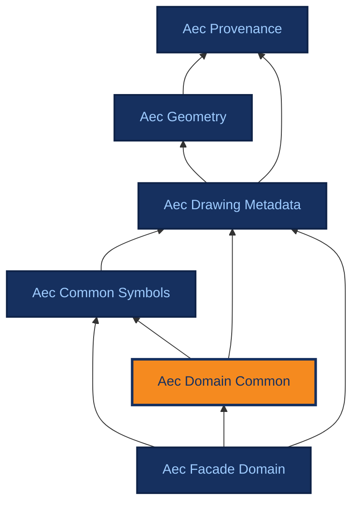

# Aec Domain Common

[{ .ontocanvas-icon } Open in OntoCanvas](https://alelom.github.io/OntoCanvas/?onto=https://w3id.org/adiro/aec_domain_common.html){ .md-button target=_blank }
[:material-file-document-outline: TTL source](https://w3id.org/adiro/aec_domain_common.ttl){ .md-button }
[:material-file-code: pyLODE HTML](https://w3id.org/adiro/aec_domain_common.html){ .md-button }

Concepts shared by several engineering domains. It sits between the common symbols and the discipline-specific modules, holding abstractions that more than one domain reuses, so they are defined once.

- **IRI:** `https://w3id.org/adiro/aec_domain_common`
- **Version:** 2.0.0
- **Imports:** `aec_common_symbols`, `aec_drawing_metadata`

## Interactive view

<iframe src="https://alelom.github.io/OntoCanvas/?onto=https://w3id.org/adiro/aec_domain_common.html" title="Aec Domain Common in OntoCanvas" loading="lazy" style="width: 100%; height: 480px; border: 1px solid var(--md-default-fg-color--lightest); border-radius: 4px;"></iframe>

## Dependencies

Arrows point from an ontology to the ontologies it imports; the current ontology is highlighted.

```mermaid
%%{init: {"themeCSS": ".base .nodeLabel,.base .nodeLabel p,.base text,.base tspan{fill:#9ecbff !important;color:#9ecbff !important}.current .nodeLabel,.current .nodeLabel p,.current text,.current tspan{fill:#16305f !important;color:#16305f !important}"} }%%
graph BT
    aec_provenance["Aec Provenance"]
    aec_geometry["Aec Geometry"]
    aec_drawing_metadata["Aec Drawing Metadata"]
    aec_common_symbols["Aec Common Symbols"]
    aec_domain_common["Aec Domain Common"]
    aec_facade_domain["Aec Facade Domain"]
    aec_geometry --> aec_provenance
    aec_drawing_metadata --> aec_geometry
    aec_drawing_metadata --> aec_provenance
    aec_common_symbols --> aec_drawing_metadata
    aec_domain_common --> aec_common_symbols
    aec_domain_common --> aec_drawing_metadata
    aec_facade_domain --> aec_common_symbols
    aec_facade_domain --> aec_domain_common
    aec_facade_domain --> aec_drawing_metadata
    click aec_provenance "../aec_provenance/" "Aec Provenance reference page"
    click aec_geometry "../aec_geometry/" "Aec Geometry reference page"
    click aec_drawing_metadata "../aec_drawing_metadata/" "Aec Drawing Metadata reference page"
    click aec_common_symbols "../aec_common_symbols/" "Aec Common Symbols reference page"
    click aec_domain_common "../aec_domain_common/" "Aec Domain Common reference page"
    click aec_facade_domain "../aec_facade_domain/" "Aec Facade Domain reference page"
    classDef base fill:#16305f,stroke:#0e2247,stroke-width:2px,color:#9ecbff;
    class aec_provenance,aec_geometry,aec_drawing_metadata,aec_common_symbols,aec_facade_domain base;
    classDef current fill:#f58a1f,stroke:#16305f,stroke-width:3px,color:#16305f;
    class aec_domain_common current;
```

## Classes

### Aluminium {#Aluminium}

Aluminium as a construction material.

- **IRI:** `https://w3id.org/adiro/aec_domain_common#Aluminium`
- **Sub class of:** [Material](#Material)

### Architectural {#Architectural}

The architectural discipline.

- **IRI:** `https://w3id.org/adiro/aec_domain_common#Architectural`
- **Sub class of:** [Discipline](#Discipline)

### Asymmetrical {#Asymmetrical}

An asymmetrical section or shape, without an axis of symmetry.

- **IRI:** `https://w3id.org/adiro/aec_domain_common#Asymmetrical`
- **Sub class of:** [Symmetry](#Symmetry)

### Beam {#Beam}

A beam - a structural member that carries load across a span, usually horizontally.

- **IRI:** `https://w3id.org/adiro/aec_domain_common#Beam`
- **Sub class of:** [Structural member](#StructuralMember)

### Brick {#Brick}

Brick used as a facing material.

- **IRI:** `https://w3id.org/adiro/aec_domain_common#Brick`
- **Sub class of:** [Facing material](#FacingMaterial)

### Cable {#Cable}

A cable - a structural member that carries load in tension.

- **IRI:** `https://w3id.org/adiro/aec_domain_common#Cable`
- **Sub class of:** [Linear structural component](#LinearStructuralComponent)

### Channel (section) {#SectionChannel}

Channel section - a structural section with a C-shaped (channel) profile.

- **IRI:** `https://w3id.org/adiro/aec_domain_common#SectionChannel`
- **Sub class of:** [Section shape](#SectionShape)

### Chord/bracing {#ChordBracing}

A chord or bracing member of a truss or braced frame.

- **IRI:** `https://w3id.org/adiro/aec_domain_common#ChordBracing`
- **Sub class of:** [Structural member](#StructuralMember)

### CHS {#CHS}

Circular hollow section - a hollow structural section with a circular profile.

- **IRI:** `https://w3id.org/adiro/aec_domain_common#CHS`
- **Sub class of:** [Section shape](#SectionShape)

### Circular {#Circular}

A circular shape.

- **IRI:** `https://w3id.org/adiro/aec_domain_common#Circular`
- **Sub class of:** [Generic shape property](#GenericShapeProperty)

### Civil {#Civil}

Civil engineering discipline.

- **IRI:** `https://w3id.org/adiro/aec_domain_common#Civil`
- **Sub class of:** [Discipline](#Discipline)

### Clay {#Clay}

Clay as a construction material, e.g. for bricks or tiles.

- **IRI:** `https://w3id.org/adiro/aec_domain_common#Clay`
- **Sub class of:** [Material](#Material)

### Column {#Column}

A column - a vertical structural member that carries load in compression.

- **IRI:** `https://w3id.org/adiro/aec_domain_common#Column`
- **Sub class of:** [Structural member](#StructuralMember)

### Concrete {#Concrete}

Concrete as a construction material.

- **IRI:** `https://w3id.org/adiro/aec_domain_common#Concrete`
- **Sub class of:** [Material](#Material)

### Dead Load {#DeadLoad}

Dead load - the permanent, static load of a structure's own weight and fixed components.

- **IRI:** `https://w3id.org/adiro/aec_domain_common#DeadLoad`
- **Sub class of:** [Structural properties](#StructuralProperties)

### Discipline {#Discipline}

The engineering or architectural discipline associated with a Layout.

- **IRI:** `https://w3id.org/adiro/aec_domain_common#Discipline`

### Electrical {#Electrical}

The electrical-engineering discipline, part of MEP.

- **IRI:** `https://w3id.org/adiro/aec_domain_common#Electrical`
- **Sub class of:** [MEP](#MEP)

### Facade {#Facade}

The facade-engineering discipline.

- **IRI:** `https://w3id.org/adiro/aec_domain_common#Facade`
- **Sub class of:** [Architectural](#Architectural)

### Facing material {#FacingMaterial}

Can be standalone label - material used for facing

- **IRI:** `https://w3id.org/adiro/aec_domain_common#FacingMaterial`

### Fire life safety {#FireLifeSafety}

The fire and life-safety discipline.

- **IRI:** `https://w3id.org/adiro/aec_domain_common#FireLifeSafety`
- **Sub class of:** [Architectural](#Architectural)

### Function {#Function}

The functional role of a drawing element.

- **IRI:** `https://w3id.org/adiro/aec_domain_common#Function`
- **Sub class of:** [Functional properties](#FunctionalProperties)

### Functional properties {#FunctionalProperties}

General property category

- **IRI:** `https://w3id.org/adiro/aec_domain_common#FunctionalProperties`

### Generic shape property {#GenericShapeProperty}

A generic shape descriptor, such as circular, rectangular or square.

- **IRI:** `https://w3id.org/adiro/aec_domain_common#GenericShapeProperty`
- **Sub class of:** [Section properties](#SectionProperties)

### Geometric properties {#GeometricProperties}

General property category

- **IRI:** `https://w3id.org/adiro/aec_domain_common#GeometricProperties`

### Glass {#Glass}

Glass as a construction material.

- **IRI:** `https://w3id.org/adiro/aec_domain_common#Glass`
- **Sub class of:** [Material](#Material)

### I-section {#ISection}

I-section - a structural section with an I- or H-shaped profile, such as a universal beam or column.

- **IRI:** `https://w3id.org/adiro/aec_domain_common#ISection`
- **Sub class of:** [Section shape](#SectionShape)

### Lighting {#Lighting}

The lighting discipline, a specialisation of electrical.

- **IRI:** `https://w3id.org/adiro/aec_domain_common#Lighting`
- **Sub class of:** [Electrical](#Electrical)

### Linear structural component {#LinearStructuralComponent}

A structural component that is essentially linear, such as a beam, column or cable.

- **IRI:** `https://w3id.org/adiro/aec_domain_common#LinearStructuralComponent`
- **Sub class of:** [Structural component](#StructuralComponent)

### Masterplan {#Masterplan}

The masterplanning discipline, covering site-wide planning.

- **IRI:** `https://w3id.org/adiro/aec_domain_common#Masterplan`
- **Sub class of:** [Discipline](#Discipline)

### Material {#Material}

A construction material a drawing element is made of.

- **IRI:** `https://w3id.org/adiro/aec_domain_common#Material`
- **Sub class of:** [Material properties](#MaterialProperties)

### Material properties {#MaterialProperties}

General property category

- **IRI:** `https://w3id.org/adiro/aec_domain_common#MaterialProperties`

### Mechanical {#Mechanical}

The mechanical-engineering discipline, part of MEP.

- **IRI:** `https://w3id.org/adiro/aec_domain_common#Mechanical`
- **Sub class of:** [MEP](#MEP)

### MEP {#MEP}

Mechanical, Electrical, and Plumbing.

- **IRI:** `https://w3id.org/adiro/aec_domain_common#MEP`
- **Sub class of:** [Discipline](#Discipline)

### Metal {#Metal}

Metal as a construction material, such as steel or aluminium.

- **IRI:** `https://w3id.org/adiro/aec_domain_common#Metal`
- **Sub class of:** [Material](#Material)

### Panel structural component {#PanelStructuralComponent}

A structural component that is essentially a panel or plate, such as a slab or wall.

- **IRI:** `https://w3id.org/adiro/aec_domain_common#PanelStructuralComponent`
- **Sub class of:** [Structural component](#StructuralComponent)

### Plumbing {#Plumbing}

The plumbing discipline, part of MEP.

- **IRI:** `https://w3id.org/adiro/aec_domain_common#Plumbing`
- **Sub class of:** [MEP](#MEP)

### Polycarbonate {#Polycarbonate}

Polycarbonate, a transparent plastic used as a glazing material.

- **IRI:** `https://w3id.org/adiro/aec_domain_common#Polycarbonate`
- **Sub class of:** [Material](#Material)

### Precast {#Precast}

Precast concrete, cast off-site in reusable moulds before installation.

- **IRI:** `https://w3id.org/adiro/aec_domain_common#Precast`
- **Sub class of:** [Material](#Material)

### Rectangular {#Rectangular}

A rectangular shape.

- **IRI:** `https://w3id.org/adiro/aec_domain_common#Rectangular`
- **Sub class of:** [Generic shape property](#GenericShapeProperty)

### Restraint {#Restraint}

A structural restraint - a support that limits the movement of a member.

- **IRI:** `https://w3id.org/adiro/aec_domain_common#Restraint`
- **Sub class of:** [Structural properties](#StructuralProperties)

### RHS {#RHS}

Rectangular hollow section - a hollow structural section with a rectangular profile.

- **IRI:** `https://w3id.org/adiro/aec_domain_common#RHS`
- **Sub class of:** [Section shape](#SectionShape)

### Section properties {#SectionProperties}

General property category

- **IRI:** `https://w3id.org/adiro/aec_domain_common#SectionProperties`

### Section shape {#SectionShape}

The cross-sectional profile of a structural section, such as an I-section, CHS or RHS.

- **IRI:** `https://w3id.org/adiro/aec_domain_common#SectionShape`
- **Sub class of:** [Section properties](#SectionProperties)

### Slab {#Slab}

A slab - a flat horizontal structural panel, such as a floor or roof slab.

- **IRI:** `https://w3id.org/adiro/aec_domain_common#Slab`
- **Sub class of:** [Panel structural component](#PanelStructuralComponent)

### Square {#Square}

A square shape.

- **IRI:** `https://w3id.org/adiro/aec_domain_common#Square`
- **Sub class of:** [Generic shape property](#GenericShapeProperty)

### Stone {#Stone}

Stone used as a facing material.

- **IRI:** `https://w3id.org/adiro/aec_domain_common#Stone`
- **Sub class of:** [Facing material](#FacingMaterial)

### Structural {#Structural}

The structural-engineering discipline.

- **IRI:** `https://w3id.org/adiro/aec_domain_common#Structural`
- **Sub class of:** [Discipline](#Discipline)

### Structural component {#StructuralComponent}

Structural component - part of support type

- **IRI:** `https://w3id.org/adiro/aec_domain_common#StructuralComponent`

### Structural member {#StructuralMember}

A linear structural member, such as a beam or column.

- **IRI:** `https://w3id.org/adiro/aec_domain_common#StructuralMember`
- **Sub class of:** [Linear structural component](#LinearStructuralComponent)

### Structural properties {#StructuralProperties}

General property category

- **IRI:** `https://w3id.org/adiro/aec_domain_common#StructuralProperties`

### Symmetrical {#Symmetrical}

A symmetrical section or shape, with an axis of symmetry.

- **IRI:** `https://w3id.org/adiro/aec_domain_common#Symmetrical`
- **Sub class of:** [Symmetry](#Symmetry)

### Symmetry {#Symmetry}

Whether a section or shape is symmetrical or asymmetrical.

- **IRI:** `https://w3id.org/adiro/aec_domain_common#Symmetry`
- **Sub class of:** [Section properties](#SectionProperties)

### Terracotta {#Terracotta}

Terracotta (fired clay) used as a facing material.

- **IRI:** `https://w3id.org/adiro/aec_domain_common#Terracotta`
- **Sub class of:** [Facing material](#FacingMaterial)

### Timber {#Timber}

Timber (wood) as a construction material.

- **IRI:** `https://w3id.org/adiro/aec_domain_common#Timber`
- **Sub class of:** [Material](#Material)

### Top hat {#TopHat}

Top-hat section - a cold-formed section with a top-hat-shaped profile.

- **IRI:** `https://w3id.org/adiro/aec_domain_common#TopHat`
- **Sub class of:** [Section shape](#SectionShape)

### Upstand {#Upstand}

An upstand - an upward projection at the edge of a slab or panel, such as a parapet.

- **IRI:** `https://w3id.org/adiro/aec_domain_common#Upstand`
- **Sub class of:** [Panel structural component](#PanelStructuralComponent)

### Wall {#Wall}

A wall - a vertical structural panel.

- **IRI:** `https://w3id.org/adiro/aec_domain_common#Wall`
- **Sub class of:** [Panel structural component](#PanelStructuralComponent)

## Object Properties

### hasDiscipline {#hasDiscipline}

Links a Layout to an AEC discipline. Discipline characterises the Layout itself, not its content type — the two are orthogonal axes.

- **IRI:** `https://w3id.org/adiro/aec_domain_common#hasDiscipline`
- **Domain:** `metadata:Layout`
- **Range:** [Discipline](#Discipline)
