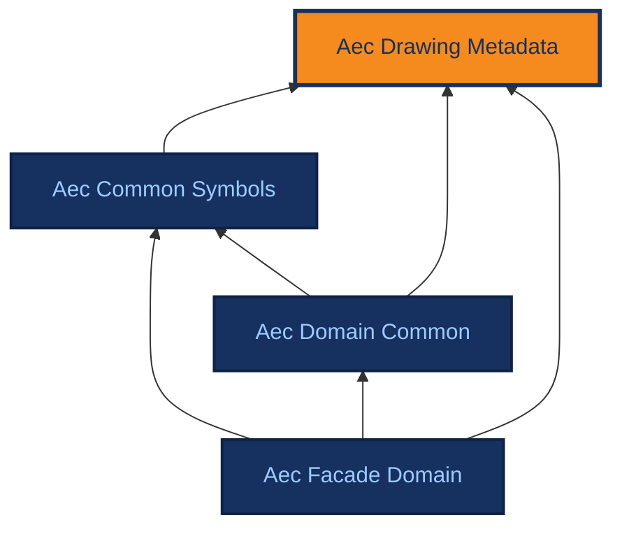

# Aec Drawing Metadata

[{ .ontocanvas-icon } Open in OntoCanvas](https://alelom.github.io/OntoCanvas/?onto=https://burohappoldmachinelearning.github.io/ADIRO/aec_drawing_metadata.html){ .md-button target=_blank }
[:material-file-document-outline: TTL source](https://burohappoldmachinelearning.github.io/ADIRO/aec_drawing_metadata.ttl){ .md-button }
[:material-file-code: pyLODE HTML](https://burohappoldmachinelearning.github.io/ADIRO/aec_drawing_metadata.html){ .md-button }

Sheet/layout/document structure for AEC drawings.

- **IRI:** `https://w3id.org/adiro/aec_drawing_metadata`
- **Version:** 2.0.0

## Dependencies

Arrows point from an ontology to the ontologies it imports; the current ontology is highlighted.

## Classes

### Detail {#Detail}

A large-scale zoomed-in drawing of a specific construction assembly or connection, showing how individual components fit together with dense material callouts and dimensions. Can be vertical or horizontal.

- **IRI:** `https://w3id.org/adiro/aec_drawing_metadata#Detail`
- **Sub class of:** [Layout content type](#LayoutContentType)
- **Restrictions:** [hasOrientation](#hasOrientation) exactly 1 [Orientation](#OrientationValue)
- **Labellable root:** true

*Example images:*

### Drawing element {#DrawingElement}

Element depicted on a drawing. Contained by Layout. Can be a Facade system or Facade component, or other domain-specific symbols, or generic symbols like dimensions, grids, etc.

- **IRI:** `https://w3id.org/adiro/aec_drawing_metadata#DrawingElement`
- **Labellable root:** false

### Drawing Sheet {#DrawingSheet}

Top-level container for a drawing. Contains Layout(s).

- **IRI:** `https://w3id.org/adiro/aec_drawing_metadata#DrawingSheet`
- **Restrictions:**
    - [contains](#contains) exactly 1 [Revision table](#RevisionTable)
    - [contains](#contains) exactly 1 [Titleblock](#Titleblock)
    - [contains](#contains) min 0 [Legend](#Legend)
    - [contains](#contains) min 0 [Note](#Note)
    - [contains](#contains) min 1 [Layout](#Layout)
- **Labellable root:** false

### DrawingPackage {#DrawingPackage}

A grouping of DrawingSheets within a Project, e.g. a volume or submission package.

- **IRI:** `https://w3id.org/adiro/aec_drawing_metadata#DrawingPackage`
- **Labellable root:** false

### DrawingRevision {#DrawingRevision}

A specific revision of a DrawingSheet. Carries revision-specific metadata: code, issue date, status, and role-differentiated person attribution.

- **IRI:** `https://w3id.org/adiro/aec_drawing_metadata#DrawingRevision`
- **Labellable root:** false

### Elevation {#Elevation}

A flat, frontal orthographic view of a building facade or interior face, showing surface appearance, window positions, and heights without revealing internal construction.

- **IRI:** `https://w3id.org/adiro/aec_drawing_metadata#Elevation`
- **Sub class of:** [Layout content type](#LayoutContentType)
- **Labellable root:** true

*Example images:*

### Image {#Image}

An image embedded within a note region on a drawing sheet.

- **IRI:** `https://w3id.org/adiro/aec_drawing_metadata#Image`
- **Sub class of:** [Note](#Note)
- **Labellable root:** true

### Layout {#Layout}

Drawing layout - contained by DrawingSheet. Contains DrawingElement(s), annotations, drawing type, and content.

- **IRI:** `https://w3id.org/adiro/aec_drawing_metadata#Layout`
- **Restrictions:**
    - [contains](#contains) min 0 [Drawing element](#DrawingElement)
    - [hasProperty](#hasProperty) exactly 1 [Layout content type](#LayoutContentType)
- **Labellable root:** true

### Layout content type {#LayoutContentType}

Type of content included in a layout.

- **IRI:** `https://w3id.org/adiro/aec_drawing_metadata#LayoutContentType`
- **Labellable root:** false

### Legend {#Legend}

A legend containing mapping information between symbols and a text signifier.

- **IRI:** `https://w3id.org/adiro/aec_drawing_metadata#Legend`
- **Sub class of:** [MetadataContainer](#MetadataContainer)
- **Labellable root:** true

*Example images:*

### MetadataContainer {#MetadataContainer}

Supporting visual region on a drawing sheet (titleblock, legend, etc.). Renamed from :Metadata to avoid confusion with semantic metadata properties on DrawingSheet.

- **IRI:** `https://w3id.org/adiro/aec_drawing_metadata#MetadataContainer`
- **Labellable root:** false

### Note {#Note}

Superclass for annotations on a drawing sheet that are not part of the drawing geometry, including textual notes and images.

- **IRI:** `https://w3id.org/adiro/aec_drawing_metadata#Note`
- **Sub class of:** [MetadataContainer](#MetadataContainer)
- **Labellable root:** true

### Orientation {#OrientationValue}

Enumerated orientation values used with hasOrientation.

- **IRI:** `https://w3id.org/adiro/aec_drawing_metadata#OrientationValue`
- **One of:**
    - [Undefined](#Undefined)
    - [Horizontal](#Horizontal)
    - [Vertical](#Vertical)
- **Labellable root:** false

### Person {#Person}

A named individual associated with a DrawingRevision in some role (author, checker, approver). The role is expressed by the object property, not by subclassing.

- **IRI:** `https://w3id.org/adiro/aec_drawing_metadata#Person`
- **Labellable root:** false

### Perspective {#Perspective}

A three-dimensional pictorial view of a building or assembly showing depth and spatial relationships, used where orthographic drawings cannot convey form.

- **IRI:** `https://w3id.org/adiro/aec_drawing_metadata#Perspective`
- **Sub class of:** [Layout content type](#LayoutContentType)
- **Labellable root:** true

### Plan {#Plan}

A horizontal cut through a building viewed from above, showing the arrangement of spaces, walls, doors, and openings at a given floor level.

- **IRI:** `https://w3id.org/adiro/aec_drawing_metadata#Plan`
- **Sub class of:** [Layout content type](#LayoutContentType)
- **Labellable root:** true

*Example images:*

### Project {#Project}

A project under which DrawingSheets are grouped.

- **IRI:** `https://w3id.org/adiro/aec_drawing_metadata#Project`
- **Labellable root:** false

### Revision table {#RevisionTable}

A table recording the documented change history of the drawing sheet, with columns for revision number, date, and description of each amendment.

- **IRI:** `https://w3id.org/adiro/aec_drawing_metadata#RevisionTable`
- **Sub class of:** [MetadataContainer](#MetadataContainer)
- **Labellable root:** true

*Example images:*

### Section {#Section}

Section drawing. Has a required property of orientation, which can be vertical or horizontal.

- **IRI:** `https://w3id.org/adiro/aec_drawing_metadata#Section`
- **Sub class of:** [Layout content type](#LayoutContentType)
- **Restrictions:** [hasOrientation](#hasOrientation) exactly 1 [Orientation](#OrientationValue)
- **Labellable root:** true

*Example images:*

### StatusCode {#StatusCode}

Controlled-vocabulary status assigned to a DrawingRevision, e.g. IFC (Issued for Construction), IFR (Issued for Review), AFC (Approved for Construction).

- **IRI:** `https://w3id.org/adiro/aec_drawing_metadata#StatusCode`
- **Labellable root:** false

### Table {#Table}

A table containing structured information, for example a schedule of elements.

- **IRI:** `https://w3id.org/adiro/aec_drawing_metadata#Table`
- **Sub class of:** [Layout content type](#LayoutContentType)
- **Labellable root:** true

*Example images:*

### Text {#TextualNote}

A free-form block of text, such as numbered lists or paragraphs, containing general requirements, assumptions, or keyed notes that apply to the drawing.

- **IRI:** `https://w3id.org/adiro/aec_drawing_metadata#TextualNote`
- **Sub class of:** [Note](#Note)
- **Labellable root:** true

*Example images:*

### Titleblock {#Titleblock}

Titleblock containing information about the drawing, for example project name, drawing title, drawing number, etc.

- **IRI:** `https://w3id.org/adiro/aec_drawing_metadata#Titleblock`
- **Sub class of:** [MetadataContainer](#MetadataContainer)
- **Labellable root:** true

*Example images:*

## Object Properties

### belongsToPackage {#belongsToPackage}

Associates a DrawingSheet with the DrawingPackage it belongs to.

- **IRI:** `https://w3id.org/adiro/aec_drawing_metadata#belongsToPackage`
- **Domain:** [Drawing Sheet](#DrawingSheet)
- **Range:** [DrawingPackage](#DrawingPackage)

### belongsToProject {#belongsToProject}

Associates a DrawingSheet with the Project it belongs to.

- **IRI:** `https://w3id.org/adiro/aec_drawing_metadata#belongsToProject`
- **Domain:** [Drawing Sheet](#DrawingSheet)
- **Range:** [Project](#Project)

### contains {#contains}

Direct containment: indicates physical containment of something within a parent thing (e.g. object in a box). Min cardinality 0 by default (can contain).

- **IRI:** `https://w3id.org/adiro/aec_drawing_metadata#contains`
- **Domain:** `owl:Thing`
- **Range:** `owl:Thing`

### hasLayout {#hasLayout}

Named containment: a DrawingSheet contains one or more Layouts.

- **IRI:** `https://w3id.org/adiro/aec_drawing_metadata#hasLayout`
- **Sub property of:** [contains](#contains)
- **Domain:** [Drawing Sheet](#DrawingSheet)
- **Range:** [Layout](#Layout)

### hasLayoutContentType {#hasLayoutContentType}

Named characterisation: a Layout has exactly one LayoutContentType.

- **IRI:** `https://w3id.org/adiro/aec_drawing_metadata#hasLayoutContentType`
- **Sub property of:** [hasProperty](#hasProperty)
- **Domain:** [Layout](#Layout)
- **Range:** [Layout content type](#LayoutContentType)

### hasOrientation {#hasOrientation}

Orientation value for layouts where orientation is applicable.

- **IRI:** `https://w3id.org/adiro/aec_drawing_metadata#hasOrientation`
- **Domain:** ([Section](#Section) or [Detail](#Detail))
- **Range:** [Orientation](#OrientationValue)

### hasProperty {#hasProperty}

Subject is characterised by a property, or quality. Used for example to indicate qualitative things like 'it is vertical' or 'it has a colour blue'.

- **IRI:** `https://w3id.org/adiro/aec_drawing_metadata#hasProperty`
- **Domain:** `owl:Thing`
- **Range:** `owl:Thing`

### hasRevision {#hasRevision}

A DrawingSheet compositionally contains its DrawingRevisions.

- **IRI:** `https://w3id.org/adiro/aec_drawing_metadata#hasRevision`
- **Sub property of:** [contains](#contains)
- **Domain:** [Drawing Sheet](#DrawingSheet)
- **Range:** [DrawingRevision](#DrawingRevision)
- **Inverse of:** [isRevisionOf](#isRevisionOf)

### hasStatusCode {#hasStatusCode}

The controlled-vocabulary StatusCode assigned to a DrawingRevision.

- **IRI:** `https://w3id.org/adiro/aec_drawing_metadata#hasStatusCode`
- **Sub property of:** [hasProperty](#hasProperty)
- **Domain:** [DrawingRevision](#DrawingRevision)
- **Range:** [StatusCode](#StatusCode)

### isApprovedBy {#isApprovedBy}

The Person who approved this DrawingRevision.

- **IRI:** `https://w3id.org/adiro/aec_drawing_metadata#isApprovedBy`
- **Domain:** [DrawingRevision](#DrawingRevision)
- **Range:** [Person](#Person)

### isAuthoredBy {#isAuthoredBy}

The Person who authored this DrawingRevision.

- **IRI:** `https://w3id.org/adiro/aec_drawing_metadata#isAuthoredBy`
- **Domain:** [DrawingRevision](#DrawingRevision)
- **Range:** [Person](#Person)

### isCheckedBy {#isCheckedBy}

The Person who checked this DrawingRevision.

- **IRI:** `https://w3id.org/adiro/aec_drawing_metadata#isCheckedBy`
- **Domain:** [DrawingRevision](#DrawingRevision)
- **Range:** [Person](#Person)

### isRevisionOf {#isRevisionOf}

Inverse of hasRevision. Navigates from a DrawingRevision back to its DrawingSheet.

- **IRI:** `https://w3id.org/adiro/aec_drawing_metadata#isRevisionOf`
- **Domain:** [DrawingRevision](#DrawingRevision)
- **Range:** [Drawing Sheet](#DrawingSheet)

## Datatype Properties

### drawingIdentifier {#drawingIdentifier}

Sheet-level identifier, e.g. 'ST-201'. Also known as 'drawing number'.

- **IRI:** `https://w3id.org/adiro/aec_drawing_metadata#drawingIdentifier`
- **Domain:** [Drawing Sheet](#DrawingSheet)
- **Range:** `xsd:string`

### drawingTitle {#drawingTitle}

Title of the drawing sheet.

- **IRI:** `https://w3id.org/adiro/aec_drawing_metadata#drawingTitle`
- **Domain:** [Drawing Sheet](#DrawingSheet)
- **Range:** `xsd:string`

### hasScale {#hasScale}

Scale notation of the drawing sheet, e.g. '1:50'.

- **IRI:** `https://w3id.org/adiro/aec_drawing_metadata#hasScale`
- **Domain:** [Drawing Sheet](#DrawingSheet)
- **Range:** `xsd:string`

### issueDate {#issueDate}

The date this revision was issued.

- **IRI:** `https://w3id.org/adiro/aec_drawing_metadata#issueDate`
- **Domain:** [DrawingRevision](#DrawingRevision)
- **Range:** `xsd:date`

### layoutIdentifier {#layoutIdentifier}

Identifier for a Layout within its parent DrawingSheet. Also known as 'layout number'. Typically a small integer or letter ('1', '2', 'A').

- **IRI:** `https://w3id.org/adiro/aec_drawing_metadata#layoutIdentifier`
- **Domain:** [Layout](#Layout)
- **Range:** `xsd:string`

### packageName {#packageName}

Name of the drawing package.

- **IRI:** `https://w3id.org/adiro/aec_drawing_metadata#packageName`
- **Domain:** [DrawingPackage](#DrawingPackage)
- **Range:** `xsd:string`

### personName {#personName}

Name of the person.

- **IRI:** `https://w3id.org/adiro/aec_drawing_metadata#personName`
- **Domain:** [Person](#Person)
- **Range:** `xsd:string`

### projectName {#projectName}

Name of the project.

- **IRI:** `https://w3id.org/adiro/aec_drawing_metadata#projectName`
- **Domain:** [Project](#Project)
- **Range:** `xsd:string`

### projectNumber {#projectNumber}

Project number.

- **IRI:** `https://w3id.org/adiro/aec_drawing_metadata#projectNumber`
- **Domain:** [Project](#Project)
- **Range:** `xsd:string`

### refersToDrawingId {#refersToDrawingId}

References another Drawing by using a drawing identifier, like a drawing number.

- **IRI:** `https://w3id.org/adiro/aec_drawing_metadata#refersToDrawingId`
- **Domain:** [Text](#TextualNote)
- **Range:** `xsd:string`

### revisionCode {#revisionCode}

The code identifying a specific revision, e.g. 'A', 'B', 'P01'.

- **IRI:** `https://w3id.org/adiro/aec_drawing_metadata#revisionCode`
- **Domain:** [DrawingRevision](#DrawingRevision)
- **Range:** `xsd:string`

### sheetSize {#sheetSize}

Sheet size designation, e.g. 'A1', 'A0'.

- **IRI:** `https://w3id.org/adiro/aec_drawing_metadata#sheetSize`
- **Domain:** [Drawing Sheet](#DrawingSheet)
- **Range:** `xsd:string`

### statusLabel {#statusLabel}

Display label for the status code, e.g. 'IFC', 'IFR', 'AFC'.

- **IRI:** `https://w3id.org/adiro/aec_drawing_metadata#statusLabel`
- **Domain:** [StatusCode](#StatusCode)
- **Range:** `xsd:string`

## Annotation Properties

### example image {#exampleImage}

Links a class or concept to an example image illustrating it.

- **IRI:** `https://w3id.org/adiro/aec_drawing_metadata#exampleImage`

### isCVATProperty {#isCVATProperty}

When true, the label is displayed on the right side of the CVAT annotation panel instead of the default left side.

- **IRI:** `https://w3id.org/adiro/aec_drawing_metadata#isCVATProperty`
- **Range:** `xsd:boolean`

### Labellable root {#labellableRoot}

When true, this class can be used as a label by annotators (solid contour in diagram). When false, non-labellable (dashed contour).

- **IRI:** `https://w3id.org/adiro/aec_drawing_metadata#labellableRoot`
- **Range:** `xsd:boolean`

## Named Individuals

### Horizontal {#Horizontal}

- **IRI:** `https://w3id.org/adiro/aec_drawing_metadata#Horizontal`
- **Type:** [Orientation](#OrientationValue)
- **Labellable root:** true

### Undefined {#Undefined}

- **IRI:** `https://w3id.org/adiro/aec_drawing_metadata#Undefined`
- **Type:** [Orientation](#OrientationValue)
- **Labellable root:** true

### Vertical {#Vertical}

- **IRI:** `https://w3id.org/adiro/aec_drawing_metadata#Vertical`
- **Type:** [Orientation](#OrientationValue)
- **Labellable root:** true
