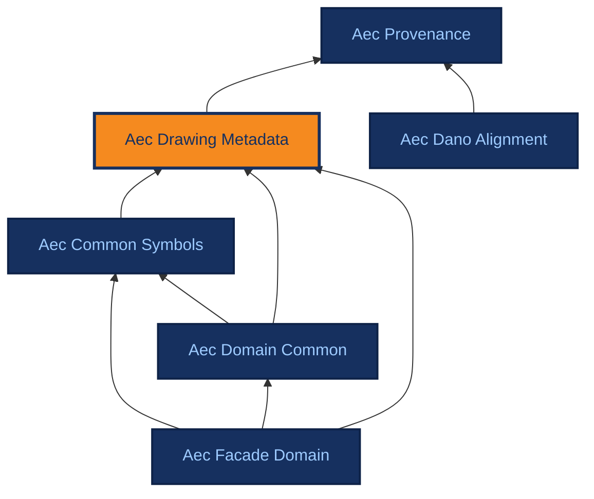

# Aec Drawing Metadata

[{ .ontocanvas-icon } Open in OntoCanvas](https://alelom.github.io/OntoCanvas/?onto=https://burohappoldmachinelearning.github.io/ADIRO/aec_drawing_metadata.html){ .md-button target=_blank }
[:material-file-document-outline: TTL source](https://burohappoldmachinelearning.github.io/ADIRO/aec_drawing_metadata.ttl){ .md-button }
[:material-file-code: pyLODE HTML](https://burohappoldmachinelearning.github.io/ADIRO/aec_drawing_metadata.html){ .md-button }

Sheet/layout/document structure for AEC drawings.

- **IRI:** `https://w3id.org/adiro/aec_drawing_metadata`
- **Version:** 3.0.0
- **Imports:** `aec_provenance`

## Dependencies

Arrows point from an ontology to the ontologies it imports; the current ontology is highlighted.

## Classes

### Detail {#Detail}

A large-scale zoomed-in drawing of a specific construction assembly or connection, showing how individual components fit together with dense material callouts and dimensions. Can be vertical or horizontal.

- **IRI:** `https://w3id.org/adiro/aec_drawing_metadata#Detail`
- **Sub class of:** [Layout content type](#LayoutContentType)
- **Restrictions:** [hasOrientation](#hasOrientation) exactly 1 [Orientation](#OrientationValue)
- **Labellable root:** true

*Example images:*

### Drawing element {#DrawingElement}

Element depicted on a drawing. Contained by Layout. Can be a Facade system or Facade component, or other domain-specific symbols, or generic symbols like dimensions, grids, etc.

- **IRI:** `https://w3id.org/adiro/aec_drawing_metadata#DrawingElement`
- **Labellable root:** false

### Drawing Sheet {#DrawingSheet}

Top-level container for a drawing. Contains Layout(s).

- **IRI:** `https://w3id.org/adiro/aec_drawing_metadata#DrawingSheet`
- **Restrictions:**
    - [contains](#contains) exactly 1 [Titleblock](#Titleblock)
    - [contains](#contains) min 0 [Key Plan](#KeyPlan)
    - [contains](#contains) min 0 [Legend](#Legend)
    - [contains](#contains) min 0 [Note](#Note)
    - [contains](#contains) min 0 [Revision table](#RevisionTable)
    - [contains](#contains) min 1 [Layout](#Layout)
- **Labellable root:** false

### DrawingPackage {#DrawingPackage}

A grouping of DrawingSheets within a Project, e.g. a volume or submission package.

- **IRI:** `https://w3id.org/adiro/aec_drawing_metadata#DrawingPackage`
- **Labellable root:** false

### DrawingRevision {#DrawingRevision}

A specific revision of a DrawingSheet. Carries revision-specific metadata: code, issue date, status, and role-differentiated person attribution.

- **IRI:** `https://w3id.org/adiro/aec_drawing_metadata#DrawingRevision`
- **Labellable root:** false

### Elevation {#Elevation}

A flat, frontal orthographic view of a building facade or interior face, showing surface appearance, window positions, and heights without revealing internal construction.

- **IRI:** `https://w3id.org/adiro/aec_drawing_metadata#Elevation`
- **Sub class of:** [Layout content type](#LayoutContentType)
- **Labellable root:** true

*Example images:*

### Image {#Image}

An image embedded within a note region on a drawing sheet.

- **IRI:** `https://w3id.org/adiro/aec_drawing_metadata#Image`
- **Sub class of:** [Note](#Note)
- **Labellable root:** true

### Key Plan {#KeyPlan}

A small locator diagram on a drawing sheet showing where the sheet's subject sits within the wider building or site, typically with the relevant area hatched or outlined. A graphical region rather than a text field: its value is the diagram, so it is modelled here as a detectable region alongside Legend and RevisionTable, not as an asserted title-block property. Contained either by a Titleblock, where it is printed inside the title-block strip, or directly by a DrawingSheet where it stands alone on the page; both placements occur and both are optional.

- **IRI:** `https://w3id.org/adiro/aec_drawing_metadata#KeyPlan`
- **Sub class of:** [MetadataContainer](#MetadataContainer)
- **Labellable root:** true

### Layout {#Layout}

Drawing layout - contained by DrawingSheet. Contains DrawingElement(s), annotations, drawing type, and content.

- **IRI:** `https://w3id.org/adiro/aec_drawing_metadata#Layout`
- **Restrictions:**
    - [contains](#contains) min 0 [Drawing element](#DrawingElement)
    - [hasProperty](#hasProperty) exactly 1 [Layout content type](#LayoutContentType)
- **Labellable root:** true

### Layout content type {#LayoutContentType}

Type of content included in a layout.

- **IRI:** `https://w3id.org/adiro/aec_drawing_metadata#LayoutContentType`
- **Labellable root:** false

### Legend {#Legend}

A legend containing mapping information between symbols and a text signifier.

- **IRI:** `https://w3id.org/adiro/aec_drawing_metadata#Legend`
- **Sub class of:** [MetadataContainer](#MetadataContainer)
- **Labellable root:** true

*Example images:*

### MetadataContainer {#MetadataContainer}

Supporting visual region on a drawing sheet (titleblock, legend, etc.). Renamed from :Metadata to avoid confusion with semantic metadata properties on DrawingSheet.

- **IRI:** `https://w3id.org/adiro/aec_drawing_metadata#MetadataContainer`
- **Labellable root:** false

### Note {#Note}

Superclass for annotations on a drawing sheet that are not part of the drawing geometry, including textual notes and images.

- **IRI:** `https://w3id.org/adiro/aec_drawing_metadata#Note`
- **Sub class of:** [MetadataContainer](#MetadataContainer)
- **Labellable root:** true

### Organisation {#Organisation}

A legal entity named in a title block — client, originator, legal owner or responsible department. Modelled as a class rather than a string so that one organisation recurring across many sheets is a single individual, which is what makes cross-sheet questions answerable. Aligns to ct:Organisation (ISO 21597-1) and IfcActorSelect; note the ISO spelling differs.

- **IRI:** `https://w3id.org/adiro/aec_drawing_metadata#Organisation`
- **Labellable root:** false

### Orientation {#OrientationValue}

Enumerated orientation values used with hasOrientation.

- **IRI:** `https://w3id.org/adiro/aec_drawing_metadata#OrientationValue`
- **One of:**
    - [Undefined](#Undefined)
    - [Horizontal](#Horizontal)
    - [Vertical](#Vertical)
- **Labellable root:** false

### Person {#Person}

A named individual associated with a DrawingRevision in some role (author, checker, approver). The role is expressed by the object property, not by subclassing.

- **IRI:** `https://w3id.org/adiro/aec_drawing_metadata#Person`
- **Labellable root:** false

### Perspective {#Perspective}

A three-dimensional pictorial view of a building or assembly showing depth and spatial relationships, used where orthographic drawings cannot convey form.

- **IRI:** `https://w3id.org/adiro/aec_drawing_metadata#Perspective`
- **Sub class of:** [Layout content type](#LayoutContentType)
- **Labellable root:** true

### Plan {#Plan}

A horizontal cut through a building viewed from above, showing the arrangement of spaces, walls, doors, and openings at a given floor level.

- **IRI:** `https://w3id.org/adiro/aec_drawing_metadata#Plan`
- **Sub class of:** [Layout content type](#LayoutContentType)
- **Labellable root:** true

*Example images:*

### Project {#Project}

A project under which DrawingSheets are grouped.

- **IRI:** `https://w3id.org/adiro/aec_drawing_metadata#Project`
- **Labellable root:** false

### Revision table {#RevisionTable}

A table recording the documented change history of the drawing sheet, with columns for revision number, date, and description of each amendment.

- **IRI:** `https://w3id.org/adiro/aec_drawing_metadata#RevisionTable`
- **Sub class of:** [MetadataContainer](#MetadataContainer)
- **Labellable root:** true

*Example images:*

### Section {#Section}

Section drawing. Has a required property of orientation, which can be vertical or horizontal.

- **IRI:** `https://w3id.org/adiro/aec_drawing_metadata#Section`
- **Sub class of:** [Layout content type](#LayoutContentType)
- **Restrictions:** [hasOrientation](#hasOrientation) exactly 1 [Orientation](#OrientationValue)
- **Labellable root:** true

*Example images:*

### StatusCode {#StatusCode}

Controlled-vocabulary status assigned to a DrawingRevision, e.g. IFC (Issued for Construction), IFR (Issued for Review), AFC (Approved for Construction).

- **IRI:** `https://w3id.org/adiro/aec_drawing_metadata#StatusCode`
- **Labellable root:** false

### Table {#Table}

A table containing structured information, for example a schedule of elements.

- **IRI:** `https://w3id.org/adiro/aec_drawing_metadata#Table`
- **Sub class of:** [Layout content type](#LayoutContentType)
- **Labellable root:** true

*Example images:*

### Text {#TextualNote}

A free-form block of text, such as numbered lists or paragraphs, containing general requirements, assumptions, or keyed notes that apply to the drawing.

- **IRI:** `https://w3id.org/adiro/aec_drawing_metadata#TextualNote`
- **Sub class of:** [Note](#Note)
- **Labellable root:** true

*Example images:*

### Titleblock {#Titleblock}

Titleblock containing information about the drawing, for example project name, drawing title, drawing number, etc. May itself contain a KeyPlan, Legend or RevisionTable, which are commonly printed inside the title-block strip rather than standing alone on the page; all three are optional, and each may alternatively be contained directly by the DrawingSheet.

- **IRI:** `https://w3id.org/adiro/aec_drawing_metadata#Titleblock`
- **Sub class of:** [MetadataContainer](#MetadataContainer)
- **Restrictions:**
    - [contains](#contains) min 0 [Key Plan](#KeyPlan)
    - [contains](#contains) min 0 [Legend](#Legend)
    - [contains](#contains) min 0 [Revision table](#RevisionTable)
- **Labellable root:** true

*Example images:*

## Object Properties

### asserts client {#assertsClient}

The organisation commissioning the work — the client or employer — as named by this title block. Universal on AEC title blocks and absent from ISO 7200, which provides only a legal-owner field. Distinct from assertsOriginator, which names the organisation that produced the sheet: on an in-house drawing both may print the same name, so the distinction is carried by the property, not by the value.

- **IRI:** `https://w3id.org/adiro/aec_drawing_metadata#assertsClient`
- **Domain:** [Titleblock](#Titleblock)
- **Range:** [Organisation](#Organisation)
- **extraction hint:** Often the most prominent organisation name on the sheet, sometimes a logo rather than text. Frequently in its own cell above or beside the originator's block.

### asserts metadata for {#assertsMetadataFor}

Links a titleblock region to the drawing sheet whose metadata it asserts. Range is DrawingSheet rather than a separate Document class: the sheet is the unit UC-01 established as searchable, and introducing a competing Document class would deepen an unresolved placement question rather than settle it.

- **IRI:** `https://w3id.org/adiro/aec_drawing_metadata#assertsMetadataFor`
- **Domain:** [Titleblock](#Titleblock)
- **Range:** [Drawing Sheet](#DrawingSheet)
- **extraction hint:** Not extracted. Asserted by the pipeline when a titleblock region is detected on a sheet.

### asserts originator {#assertsOriginator}

The organisation that produced the drawing — the originator in ISO 19650-2 terms, and one segment of the information-container identifier. This is the practice or consultancy whose name and logo appear as author of the sheet. Distinct from assertsClient, which names who commissioned the work.

- **IRI:** `https://w3id.org/adiro/aec_drawing_metadata#assertsOriginator`
- **Domain:** [Titleblock](#Titleblock)
- **Range:** [Organisation](#Organisation)
- **extraction hint:** Usually the organisation whose logo sits in or beside the title block, and whose code appears in the drawing-number originator segment.

### belongsToPackage {#belongsToPackage}

Associates a DrawingSheet with the DrawingPackage it belongs to.

- **IRI:** `https://w3id.org/adiro/aec_drawing_metadata#belongsToPackage`
- **Domain:** [Drawing Sheet](#DrawingSheet)
- **Range:** [DrawingPackage](#DrawingPackage)

### belongsToProject {#belongsToProject}

Associates a DrawingSheet with the Project it belongs to.

- **IRI:** `https://w3id.org/adiro/aec_drawing_metadata#belongsToProject`
- **Domain:** [Drawing Sheet](#DrawingSheet)
- **Range:** [Project](#Project)

### contains {#contains}

Direct containment: indicates physical containment of something within a parent thing (e.g. object in a box). Min cardinality 0 by default (can contain).

- **IRI:** `https://w3id.org/adiro/aec_drawing_metadata#contains`
- **Domain:** `owl:Thing`
- **Range:** `owl:Thing`

### hasLayout {#hasLayout}

Named containment: a DrawingSheet contains one or more Layouts.

- **IRI:** `https://w3id.org/adiro/aec_drawing_metadata#hasLayout`
- **Sub property of:** [contains](#contains)
- **Domain:** [Drawing Sheet](#DrawingSheet)
- **Range:** [Layout](#Layout)

### hasLayoutContentType {#hasLayoutContentType}

Named characterisation: a Layout has exactly one LayoutContentType.

- **IRI:** `https://w3id.org/adiro/aec_drawing_metadata#hasLayoutContentType`
- **Sub property of:** [hasProperty](#hasProperty)
- **Domain:** [Layout](#Layout)
- **Range:** [Layout content type](#LayoutContentType)

### hasOrientation {#hasOrientation}

Orientation value for layouts where orientation is applicable.

- **IRI:** `https://w3id.org/adiro/aec_drawing_metadata#hasOrientation`
- **Domain:** ([Section](#Section) or [Detail](#Detail))
- **Range:** [Orientation](#OrientationValue)

### hasProperty {#hasProperty}

Subject is characterised by a property, or quality. Used for example to indicate qualitative things like 'it is vertical' or 'it has a colour blue'.

- **IRI:** `https://w3id.org/adiro/aec_drawing_metadata#hasProperty`
- **Domain:** `owl:Thing`
- **Range:** `owl:Thing`

### hasRevision {#hasRevision}

A DrawingSheet compositionally contains its DrawingRevisions. To navigate from a revision back to its sheet, use the SPARQL inverse path ^metadata:hasRevision - ADIRO declares no named inverse properties and no owl:inverseOf axioms (see GitHub issue #21).

- **IRI:** `https://w3id.org/adiro/aec_drawing_metadata#hasRevision`
- **Sub property of:** [contains](#contains)
- **Domain:** [Drawing Sheet](#DrawingSheet)
- **Range:** [DrawingRevision](#DrawingRevision)

### hasStatusCode {#hasStatusCode}

The controlled-vocabulary StatusCode assigned to a DrawingRevision.

- **IRI:** `https://w3id.org/adiro/aec_drawing_metadata#hasStatusCode`
- **Sub property of:** [hasProperty](#hasProperty)
- **Domain:** [DrawingRevision](#DrawingRevision)
- **Range:** [StatusCode](#StatusCode)

### isApprovedBy {#isApprovedBy}

The Person who approved this DrawingRevision.

- **IRI:** `https://w3id.org/adiro/aec_drawing_metadata#isApprovedBy`
- **Domain:** [DrawingRevision](#DrawingRevision)
- **Range:** [Person](#Person)

### isAuthoredBy {#isAuthoredBy}

The Person who authored this DrawingRevision.

- **IRI:** `https://w3id.org/adiro/aec_drawing_metadata#isAuthoredBy`
- **Domain:** [DrawingRevision](#DrawingRevision)
- **Range:** [Person](#Person)

### isCheckedBy {#isCheckedBy}

The Person who checked this DrawingRevision.

- **IRI:** `https://w3id.org/adiro/aec_drawing_metadata#isCheckedBy`
- **Domain:** [DrawingRevision](#DrawingRevision)
- **Range:** [Person](#Person)

## Datatype Properties

### assertsCrossReferenceNumber {#assertsCrossReferenceNumber}

A second (or third) identifier the title block prints for the same sheet, issued by a system other than the one drawingIdentifier is read from — a design-team-internal number, a client/EDMS document number, or a sketch/site-advice reference. Stored whole and verbatim, not parsed into segments; which system issued it is not modelled as a controlled vocabulary here, so that distinction is carried by extractionHint only.

- **IRI:** `https://w3id.org/adiro/aec_drawing_metadata#assertsCrossReferenceNumber`
- **Domain:** [Titleblock](#Titleblock)
- **Range:** `xsd:string`
- **extraction hint:** A second coded number near or below the primary drawing number, often prefixed by the issuing system's initials (e.g. a sketch/site-advice code, or an EDMS platform's own document ID). Do not conflate with drawingIdentifier — capture only when a sheet prints more than one numbering system.

### drawingIdentifier {#drawingIdentifier}

Sheet-level identifier, e.g. 'ST-201'. Also known as 'drawing number'.

- **IRI:** `https://w3id.org/adiro/aec_drawing_metadata#drawingIdentifier`
- **Domain:** [Drawing Sheet](#DrawingSheet)
- **Range:** `xsd:string`

### drawingTitle {#drawingTitle}

Title of the drawing sheet.

- **IRI:** `https://w3id.org/adiro/aec_drawing_metadata#drawingTitle`
- **Domain:** [Drawing Sheet](#DrawingSheet)
- **Range:** `xsd:string`

### hasScale {#hasScale}

Scale notation, e.g. '1:50'. Applies to a DrawingSheet where one scale governs the whole sheet, and to a Layout where the sheet carries several drawings at different scales — a detail at 1:5 beside a plan at 1:100 is ordinary. Where a Layout carries its own value it is the more specific one and describes that drawing; the sheet-level value, where both are present, is the sheet's nominal or predominant scale rather than a claim about every layout on it.

- **IRI:** `https://w3id.org/adiro/aec_drawing_metadata#hasScale`
- **Domain:** ([Drawing Sheet](#DrawingSheet) or [Layout](#Layout))
- **Range:** `xsd:string`

### issueDate {#issueDate}

The date this revision was issued.

- **IRI:** `https://w3id.org/adiro/aec_drawing_metadata#issueDate`
- **Domain:** [DrawingRevision](#DrawingRevision)
- **Range:** `xsd:date`

### layoutIdentifier {#layoutIdentifier}

Identifier for a Layout within its parent DrawingSheet. Also known as 'layout number'. Typically a small integer or letter ('1', '2', 'A').

- **IRI:** `https://w3id.org/adiro/aec_drawing_metadata#layoutIdentifier`
- **Domain:** [Layout](#Layout)
- **Range:** `xsd:string`

### layoutTitle {#layoutTitle}

The caption naming an individual Layout, distinct from the sheet-level drawingTitle. A sheet routinely carries several drawings — details, sections, plans at different scales — each with its own printed title such as 'Mullion Head Detail' or 'Ground Floor Plan'. Pairs with layoutIdentifier as title-to-number: the identifier says which layout, this says what it depicts.

- **IRI:** `https://w3id.org/adiro/aec_drawing_metadata#layoutTitle`
- **Domain:** [Layout](#Layout)
- **Range:** `xsd:string`
- **extraction hint:** Printed adjacent to its layout rather than in the title block — usually directly beneath or above the drawing, often with the layout number and scale in the same caption line ('3  MULLION HEAD  1:5'). Capture only the descriptive part: that caption decomposes across three properties on the same Layout — layoutIdentifier '3', layoutTitle 'MULLION HEAD', hasScale '1:5'. Do not confuse with drawingTitle, which is the single sheet-level title inside the title block.

### organisationName {#organisationName}

The name of an organisation as printed. Parallels personName. Verbatim: not normalised, expanded or translated at extraction time.

- **IRI:** `https://w3id.org/adiro/aec_drawing_metadata#organisationName`
- **Domain:** [Organisation](#Organisation)
- **Range:** `xsd:string`
- **extraction hint:** Transcribe exactly as printed, including any legal suffix.

### packageName {#packageName}

Name of the drawing package.

- **IRI:** `https://w3id.org/adiro/aec_drawing_metadata#packageName`
- **Domain:** [DrawingPackage](#DrawingPackage)
- **Range:** `xsd:string`

### personName {#personName}

Name of the person.

- **IRI:** `https://w3id.org/adiro/aec_drawing_metadata#personName`
- **Domain:** [Person](#Person)
- **Range:** `xsd:string`

### projectName {#projectName}

Name of the project.

- **IRI:** `https://w3id.org/adiro/aec_drawing_metadata#projectName`
- **Domain:** [Project](#Project)
- **Range:** `xsd:string`

### projectNumber {#projectNumber}

Project number.

- **IRI:** `https://w3id.org/adiro/aec_drawing_metadata#projectNumber`
- **Domain:** [Project](#Project)
- **Range:** `xsd:string`

### refersToDrawingId {#refersToDrawingId}

References another Drawing by using a drawing identifier, like a drawing number.

- **IRI:** `https://w3id.org/adiro/aec_drawing_metadata#refersToDrawingId`
- **Domain:** [Text](#TextualNote)
- **Range:** `xsd:string`

### revisionCode {#revisionCode}

The code identifying a specific revision, e.g. 'A', 'B', 'P01'.

- **IRI:** `https://w3id.org/adiro/aec_drawing_metadata#revisionCode`
- **Domain:** [DrawingRevision](#DrawingRevision)
- **Range:** `xsd:string`

### sheetSize {#sheetSize}

Sheet size designation, e.g. 'A1', 'A0'.

- **IRI:** `https://w3id.org/adiro/aec_drawing_metadata#sheetSize`
- **Domain:** [Drawing Sheet](#DrawingSheet)
- **Range:** `xsd:string`

### statusLabel {#statusLabel}

Display label for the status code, e.g. 'IFC', 'IFR', 'AFC'.

- **IRI:** `https://w3id.org/adiro/aec_drawing_metadata#statusLabel`
- **Domain:** [StatusCode](#StatusCode)
- **Range:** `xsd:string`

## Annotation Properties

### example image {#exampleImage}

Links a class or concept to an example image illustrating it.

- **IRI:** `https://w3id.org/adiro/aec_drawing_metadata#exampleImage`

### extraction hint {#extractionHint}

Free-text guidance for an information-extraction model on where and how a field typically appears on a drawing sheet (adjacent captions, cell grouping, formatting). Consumed by the generated extraction profile, not by reasoning.

- **IRI:** `https://w3id.org/adiro/aec_drawing_metadata#extractionHint`
- **Range:** `xsd:string`

### isCVATProperty {#isCVATProperty}

Presentation hint for downstream annotation tooling: when true, the label should be displayed on the trailing side of the tool's label panel rather than the default leading side. Carries no reasoning weight. The property name still carries a tool name and is due to be renamed - see GitHub issue #89.

- **IRI:** `https://w3id.org/adiro/aec_drawing_metadata#isCVATProperty`
- **Range:** `xsd:boolean`

### Labellable root {#labellableRoot}

When true, this class can be used as a label by annotators (solid contour in diagram). When false, non-labellable (dashed contour).

- **IRI:** `https://w3id.org/adiro/aec_drawing_metadata#labellableRoot`
- **Range:** `xsd:boolean`

## Named Individuals

### Horizontal {#Horizontal}

- **IRI:** `https://w3id.org/adiro/aec_drawing_metadata#Horizontal`
- **Type:** [Orientation](#OrientationValue)
- **Labellable root:** true

### Undefined {#Undefined}

- **IRI:** `https://w3id.org/adiro/aec_drawing_metadata#Undefined`
- **Type:** [Orientation](#OrientationValue)
- **Labellable root:** true

### Vertical {#Vertical}

- **IRI:** `https://w3id.org/adiro/aec_drawing_metadata#Vertical`
- **Type:** [Orientation](#OrientationValue)
- **Labellable root:** true
