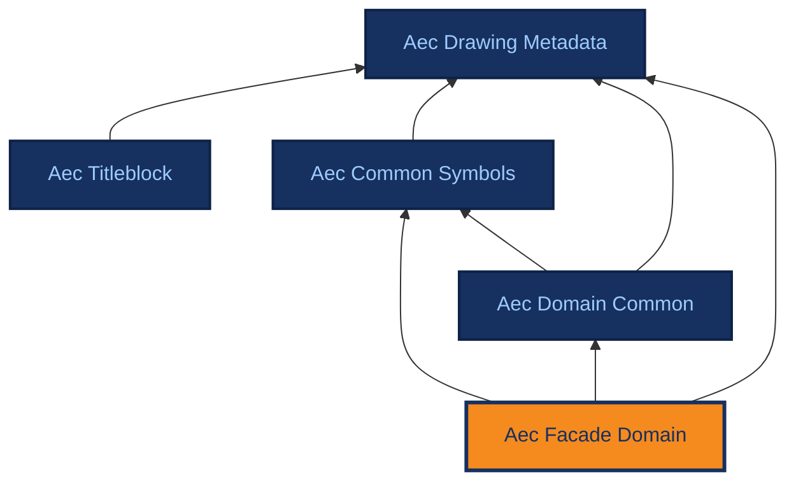

# Aec Facade Domain

[{ .ontocanvas-icon } Open in OntoCanvas](https://alelom.github.io/OntoCanvas/?onto=https://burohappoldmachinelearning.github.io/ADIRO/aec_facade_domain.html){ .md-button target=_blank }
[:material-file-document-outline: TTL source](https://burohappoldmachinelearning.github.io/ADIRO/aec_facade_domain.ttl){ .md-button }
[:material-file-code: pyLODE HTML](https://burohappoldmachinelearning.github.io/ADIRO/aec_facade_domain.html){ .md-button }

Facade-specific concepts and symbols for facade engineering drawings.

- **IRI:** `https://w3id.org/adiro/aec_facade_domain`
- **Version:** 1.0.0
- **Imports:** `aec_common_symbols`, `aec_domain_common`, `aec_drawing_metadata`

## Dependencies

Arrows point from an ontology to the ontologies it imports; the current ontology is highlighted.

## Classes

### Add-on {#AddOn}

- **IRI:** `https://w3id.org/adiro/aec_facade_domain#AddOn`
- **Sub class of:** [Frame type](#FrameType)

### Backing wall {#BackingWall}

- **IRI:** `https://w3id.org/adiro/aec_facade_domain#BackingWall`
- **Sub class of:** [Panel component](#PanelComponent)

### Blockwork {#Blockwork}

- **IRI:** `https://w3id.org/adiro/aec_facade_domain#Blockwork`
- **Sub class of:** [Roof cladding](#RoofCladding)

### Board {#Board}

- **IRI:** `https://w3id.org/adiro/aec_facade_domain#Board`
- **Sub class of:** [Panel component](#PanelComponent)

### Bracket {#Bracket}

- **IRI:** `https://w3id.org/adiro/aec_facade_domain#Bracket`
- **Sub class of:** [Point component](#PointComponent)

### Breather {#BreatherMembrane}

- **IRI:** `https://w3id.org/adiro/aec_facade_domain#BreatherMembrane`
- **Sub class of:** [Membrane](#Membrane)

### Capped {#Capped}

- **IRI:** `https://w3id.org/adiro/aec_facade_domain#Capped`
- **Sub class of:** [Glazing retention](#GlazingRetention)

### Capping {#Capping}

- **IRI:** `https://w3id.org/adiro/aec_facade_domain#Capping`
- **Sub class of:** [Linear component](#LinearComponent)

### Cast-in channel {#CastInChannel}

- **IRI:** `https://w3id.org/adiro/aec_facade_domain#CastInChannel`
- **Sub class of:** [Fixing](#Fixing)

### Cavity barrier {#CavityBarrier}

- **IRI:** `https://w3id.org/adiro/aec_facade_domain#CavityBarrier`
- **Sub class of:** [Gasket](#Gasket)

### Cavity wall system {#CavityWallSystem}

- **IRI:** `https://w3id.org/adiro/aec_facade_domain#CavityWallSystem`
- **Sub class of:** [Facade system](#FacadeSystem)

### Cementboard {#Cementboard}

- **IRI:** `https://w3id.org/adiro/aec_facade_domain#Cementboard`
- **Sub class of:** [Board](#Board)

### Channel {#Channel}

- **IRI:** `https://w3id.org/adiro/aec_facade_domain#Channel`
- **Sub class of:** [Gasket](#Gasket)

### Closed state {#ClosedState}

- **IRI:** `https://w3id.org/adiro/aec_facade_domain#ClosedState`
- **Sub class of:** [Cavity barrier](#CavityBarrier)

### Curtain wall system {#CurtainWallSystem}

- **IRI:** `https://w3id.org/adiro/aec_facade_domain#CurtainWallSystem`
- **Sub class of:** [Facade system](#FacadeSystem)

### Curved {#Curved}

- **IRI:** `https://w3id.org/adiro/aec_facade_domain#Curved`
- **Sub class of:** [Facade shape](#FacadeShape)

### CW frame member {#CWFrameMember}

- **IRI:** `https://w3id.org/adiro/aec_facade_domain#CWFrameMember`
- **Sub class of:** [Linear component](#LinearComponent)

### CW frame member properties {#CWFrameMemberProperties}

Specific properties of curtain wall frame members

- **IRI:** `https://w3id.org/adiro/aec_facade_domain#CWFrameMemberProperties`

### CW system {#CWSystem}

- **IRI:** `https://w3id.org/adiro/aec_facade_domain#CWSystem`
- **Sub class of:** [CW frame member properties](#CWFrameMemberProperties)

### Dead Load Bracket {#DeadLoadBracket}

Dead load bracket

- **IRI:** `https://w3id.org/adiro/aec_facade_domain#DeadLoadBracket`
- **Sub class of:** [Bracket](#Bracket)

### DGU {#DGU}

Double Glazing Unit

- **IRI:** `https://w3id.org/adiro/aec_facade_domain#DGU`
- **Sub class of:** [Facade cladding](#FacadeCladding)

### Double laminated {#DoubleLaminated}

- **IRI:** `https://w3id.org/adiro/aec_facade_domain#DoubleLaminated`
- **Sub class of:** [Glazing properties](#GlazingProperties)

### EPDM {#EPDM}

- **IRI:** `https://w3id.org/adiro/aec_facade_domain#EPDM`
- **Sub class of:** [Membrane](#Membrane)

### Extruded {#Extruded}

- **IRI:** `https://w3id.org/adiro/aec_facade_domain#Extruded`
- **Sub class of:** [Frame type](#FrameType)

### Fabricated {#Fabricated}

- **IRI:** `https://w3id.org/adiro/aec_facade_domain#Fabricated`
- **Sub class of:** [Frame type](#FrameType)

### Facade cladding {#FacadeCladding}

- **IRI:** `https://w3id.org/adiro/aec_facade_domain#FacadeCladding`
- **Sub class of:** [Panel component](#PanelComponent)

### Facade component {#FacadeComponent}

Component of a facade system; a type of drawing element

- **IRI:** `https://w3id.org/adiro/aec_facade_domain#FacadeComponent`
- **Sub class of:** `metadata:DrawingElement`

### Facade secondary structure {#FacadeSecondaryStructure}

- **IRI:** `https://w3id.org/adiro/aec_facade_domain#FacadeSecondaryStructure`
- **Sub class of:** [Linear component](#LinearComponent)

### Facade shape {#FacadeShape}

- **IRI:** `https://w3id.org/adiro/aec_facade_domain#FacadeShape`
- **Sub class of:** `dcommon:GeometricProperties`

### Facade system {#FacadeSystem}

Facade system - part of support type; a type of drawing element

- **IRI:** `https://w3id.org/adiro/aec_facade_domain#FacadeSystem`
- **Sub class of:** `metadata:DrawingElement`
- **Restrictions:** `metadata:contains` some [Facade component](#FacadeComponent)

### Faceted {#Faceted}

- **IRI:** `https://w3id.org/adiro/aec_facade_domain#Faceted`
- **Sub class of:** [Facade shape](#FacadeShape)

### Fin {#Fin}

- **IRI:** `https://w3id.org/adiro/aec_facade_domain#Fin`
- **Sub class of:** [Linear component](#LinearComponent)

### Firestop {#Firestop}

- **IRI:** `https://w3id.org/adiro/aec_facade_domain#Firestop`
- **Sub class of:** [Linear component](#LinearComponent)

### Fixing {#Fixing}

- **IRI:** `https://w3id.org/adiro/aec_facade_domain#Fixing`
- **Sub class of:** [Point component](#PointComponent)

### Flipper {#Flipper}

- **IRI:** `https://w3id.org/adiro/aec_facade_domain#Flipper`
- **Sub class of:** [Gasket](#Gasket)

### Frame type {#FrameType}

- **IRI:** `https://w3id.org/adiro/aec_facade_domain#FrameType`
- **Sub class of:** [CW frame member properties](#CWFrameMemberProperties)

### Gasket {#Gasket}

- **IRI:** `https://w3id.org/adiro/aec_facade_domain#Gasket`
- **Sub class of:** [Linear component](#LinearComponent)

### Glazing properties {#GlazingProperties}

Specific properties of glazing elements

- **IRI:** `https://w3id.org/adiro/aec_facade_domain#GlazingProperties`

### Glazing retention {#GlazingRetention}

- **IRI:** `https://w3id.org/adiro/aec_facade_domain#GlazingRetention`
- **Sub class of:** [CW frame member properties](#CWFrameMemberProperties)

### GRC {#GRC}

- **IRI:** `https://w3id.org/adiro/aec_facade_domain#GRC`
- **Sub class of:** [Precast system](#PrecastSystem)

### Helping hand {#HelpingHandBracket}

Helping hand bracket

- **IRI:** `https://w3id.org/adiro/aec_facade_domain#HelpingHandBracket`
- **Sub class of:** [Bracket](#Bracket)

### Hollow gasket shape {#HollowGasketShape}

- **IRI:** `https://w3id.org/adiro/aec_facade_domain#HollowGasketShape`
- **Sub class of:** [Gasket](#Gasket)

### Insulation {#Insulation}

- **IRI:** `https://w3id.org/adiro/aec_facade_domain#Insulation`
- **Sub class of:** [Panel component](#PanelComponent)

### Laminated {#Laminated}

- **IRI:** `https://w3id.org/adiro/aec_facade_domain#Laminated`
- **Sub class of:** [Glazing properties](#GlazingProperties)

### Linear component {#LinearComponent}

Element category - linear facade component

- **IRI:** `https://w3id.org/adiro/aec_facade_domain#LinearComponent`
- **Sub class of:** [Facade component](#FacadeComponent)

### Localised penetration {#LocalisedPenetration}

- **IRI:** `https://w3id.org/adiro/aec_facade_domain#LocalisedPenetration`
- **Sub class of:** [Point component](#PointComponent)

### Louvre {#Louvre}

- **IRI:** `https://w3id.org/adiro/aec_facade_domain#Louvre`
- **Sub class of:** [Linear component](#LinearComponent)

### Masonry {#Masonry}

- **IRI:** `https://w3id.org/adiro/aec_facade_domain#Masonry`
- **Sub class of:** [Facade cladding](#FacadeCladding)

### Membrane {#Membrane}

- **IRI:** `https://w3id.org/adiro/aec_facade_domain#Membrane`
- **Sub class of:** [Panel component](#PanelComponent)

### Mineral wool {#MineralWool}

- **IRI:** `https://w3id.org/adiro/aec_facade_domain#MineralWool`
- **Sub class of:** [Insulation](#Insulation)

### Monolithic {#Monolithic}

- **IRI:** `https://w3id.org/adiro/aec_facade_domain#Monolithic`
- **Sub class of:** [Glazing properties](#GlazingProperties)

### Mullion {#Mullion}

- **IRI:** `https://w3id.org/adiro/aec_facade_domain#Mullion`
- **Sub class of:** [CW frame member](#CWFrameMember)

### O-gasket {#OGasket}

- **IRI:** `https://w3id.org/adiro/aec_facade_domain#OGasket`
- **Sub class of:** [Hollow gasket shape](#HollowGasketShape)

### Open state {#OpenState}

- **IRI:** `https://w3id.org/adiro/aec_facade_domain#OpenState`
- **Sub class of:** [Cavity barrier](#CavityBarrier)

### Other insulation {#OtherInsulation}

- **IRI:** `https://w3id.org/adiro/aec_facade_domain#OtherInsulation`
- **Sub class of:** [Insulation](#Insulation)

### P-gasket {#PGasket}

- **IRI:** `https://w3id.org/adiro/aec_facade_domain#PGasket`
- **Sub class of:** [Hollow gasket shape](#HollowGasketShape)

### Panel component {#PanelComponent}

Element category - panel-type facade component

- **IRI:** `https://w3id.org/adiro/aec_facade_domain#PanelComponent`
- **Sub class of:** [Facade component](#FacadeComponent)

### Planar {#Planar}

- **IRI:** `https://w3id.org/adiro/aec_facade_domain#Planar`
- **Sub class of:** [Facade shape](#FacadeShape)

### Plasterboard {#Plasterboard}

- **IRI:** `https://w3id.org/adiro/aec_facade_domain#Plasterboard`
- **Sub class of:** [Board](#Board)

### Point component {#PointComponent}

Element category - point-type facade component

- **IRI:** `https://w3id.org/adiro/aec_facade_domain#PointComponent`
- **Sub class of:** [Facade component](#FacadeComponent)

### Precast concrete {#PrecastConcrete}

- **IRI:** `https://w3id.org/adiro/aec_facade_domain#PrecastConcrete`
- **Sub class of:** [Facade cladding](#FacadeCladding)

### Precast restraint {#PrecastRestraintBracket}

Precast restraint bracket

- **IRI:** `https://w3id.org/adiro/aec_facade_domain#PrecastRestraintBracket`
- **Sub class of:** [Bracket](#Bracket)

### Precast system {#PrecastSystem}

- **IRI:** `https://w3id.org/adiro/aec_facade_domain#PrecastSystem`
- **Sub class of:** [Facade system](#FacadeSystem)

### Profiled metal {#ProfiledMetal}

- **IRI:** `https://w3id.org/adiro/aec_facade_domain#ProfiledMetal`
- **Sub class of:** [Facade cladding](#FacadeCladding)

### Push-in {#PushIn}

- **IRI:** `https://w3id.org/adiro/aec_facade_domain#PushIn`
- **Sub class of:** [Solid gasket shape](#SolidGasketShape)

### Rail {#Rail}

- **IRI:** `https://w3id.org/adiro/aec_facade_domain#Rail`
- **Sub class of:** [Facade secondary structure](#FacadeSecondaryStructure)

### Rainscreen {#RainscreenSystem}

- **IRI:** `https://w3id.org/adiro/aec_facade_domain#RainscreenSystem`
- **Sub class of:** [Facade system](#FacadeSystem)

### Reflvet {#Reflvet}

- **IRI:** `https://w3id.org/adiro/aec_facade_domain#Reflvet`
- **Sub class of:** [Gasket](#Gasket)

### Roof cladding {#RoofCladding}

- **IRI:** `https://w3id.org/adiro/aec_facade_domain#RoofCladding`
- **Sub class of:** [Panel component](#PanelComponent)

### Screw {#Screw}

- **IRI:** `https://w3id.org/adiro/aec_facade_domain#Screw`
- **Sub class of:** [Fixing](#Fixing)

### Sealant {#Sealant}

- **IRI:** `https://w3id.org/adiro/aec_facade_domain#Sealant`
- **Sub class of:** [Linear component](#LinearComponent)

### Semi Unitised Curtain Wall {#SemiUnitisedCurtainWall}

Semi-unitised curtain wall

- **IRI:** `https://w3id.org/adiro/aec_facade_domain#SemiUnitisedCurtainWall`
- **Sub class of:** [Curtain wall system](#CurtainWallSystem)

### Serrated/Sawtooth {#SerratedSawtooth}

- **IRI:** `https://w3id.org/adiro/aec_facade_domain#SerratedSawtooth`
- **Sub class of:** [Facade shape](#FacadeShape)

### SFS {#SFS}

Steel Frame System

- **IRI:** `https://w3id.org/adiro/aec_facade_domain#SFS`
- **Sub class of:** [Backing wall](#BackingWall)

### Shelf angle {#ShelfAngle}

- **IRI:** `https://w3id.org/adiro/aec_facade_domain#ShelfAngle`
- **Sub class of:** [Facade secondary structure](#FacadeSecondaryStructure)

### Silicone {#Silicone}

- **IRI:** `https://w3id.org/adiro/aec_facade_domain#Silicone`
- **Sub class of:** [Sealant](#Sealant)

### Slide-in {#SlideIn}

- **IRI:** `https://w3id.org/adiro/aec_facade_domain#SlideIn`
- **Sub class of:** [Solid gasket shape](#SolidGasketShape)

### Small panels {#SmallPanels}

- **IRI:** `https://w3id.org/adiro/aec_facade_domain#SmallPanels`
- **Sub class of:** [Facade cladding](#FacadeCladding)

### Solid gasket shape {#SolidGasketShape}

- **IRI:** `https://w3id.org/adiro/aec_facade_domain#SolidGasketShape`
- **Sub class of:** [Gasket](#Gasket)

### SSG (Structural silicone glazing) {#SSG}

- **IRI:** `https://w3id.org/adiro/aec_facade_domain#SSG`
- **Sub class of:** [Glazing retention](#GlazingRetention)

### Stick {#Stick}

- **IRI:** `https://w3id.org/adiro/aec_facade_domain#Stick`
- **Sub class of:** [CW system](#CWSystem)

### Stick Curtain Wall {#StickCurtainWall}

Stick curtain wall

- **IRI:** `https://w3id.org/adiro/aec_facade_domain#StickCurtainWall`
- **Sub class of:** [Curtain wall system](#CurtainWallSystem)

### TGU {#TGU}

Triple Glazed Unit

- **IRI:** `https://w3id.org/adiro/aec_facade_domain#TGU`
- **Sub class of:** [Facade cladding](#FacadeCladding)

### Timber cassette {#TimberCassette}

- **IRI:** `https://w3id.org/adiro/aec_facade_domain#TimberCassette`
- **Sub class of:** [Roof cladding](#RoofCladding)

### Toggle {#Toggle}

- **IRI:** `https://w3id.org/adiro/aec_facade_domain#Toggle`
- **Sub class of:** [Glazing retention](#GlazingRetention)

### Transom {#Transom}

- **IRI:** `https://w3id.org/adiro/aec_facade_domain#Transom`
- **Sub class of:** [CW frame member](#CWFrameMember)

### UMPC {#UMPC}

- **IRI:** `https://w3id.org/adiro/aec_facade_domain#UMPC`
- **Sub class of:** [Precast system](#PrecastSystem)

### Unitised {#Unitised}

- **IRI:** `https://w3id.org/adiro/aec_facade_domain#Unitised`
- **Sub class of:** [CW system](#CWSystem)

### Unitised Curtain Wall {#UnitisedCurtainWall}

Unitised curtain wall

- **IRI:** `https://w3id.org/adiro/aec_facade_domain#UnitisedCurtainWall`
- **Sub class of:** [Curtain wall system](#CurtainWallSystem)

### VCL (Vapour control layer) {#VCL}

- **IRI:** `https://w3id.org/adiro/aec_facade_domain#VCL`
- **Sub class of:** [Insulation](#Insulation)

### Waterproofing {#WaterproofingMembrane}

- **IRI:** `https://w3id.org/adiro/aec_facade_domain#WaterproofingMembrane`
- **Sub class of:** [Membrane](#Membrane)

### Wedge {#Wedge}

- **IRI:** `https://w3id.org/adiro/aec_facade_domain#Wedge`
- **Sub class of:** [Solid gasket shape](#SolidGasketShape)

### Welded bolt {#WeldedBolt}

- **IRI:** `https://w3id.org/adiro/aec_facade_domain#WeldedBolt`
- **Sub class of:** [Fixing](#Fixing)

### Window system {#WindowSystem}

- **IRI:** `https://w3id.org/adiro/aec_facade_domain#WindowSystem`
- **Sub class of:** [Linear component](#LinearComponent)

### Wood fibre {#WoodFibre}

- **IRI:** `https://w3id.org/adiro/aec_facade_domain#WoodFibre`
- **Sub class of:** [Insulation](#Insulation)

### Zig-zag {#ZigZag}

- **IRI:** `https://w3id.org/adiro/aec_facade_domain#ZigZag`
- **Sub class of:** [Facade shape](#FacadeShape)
