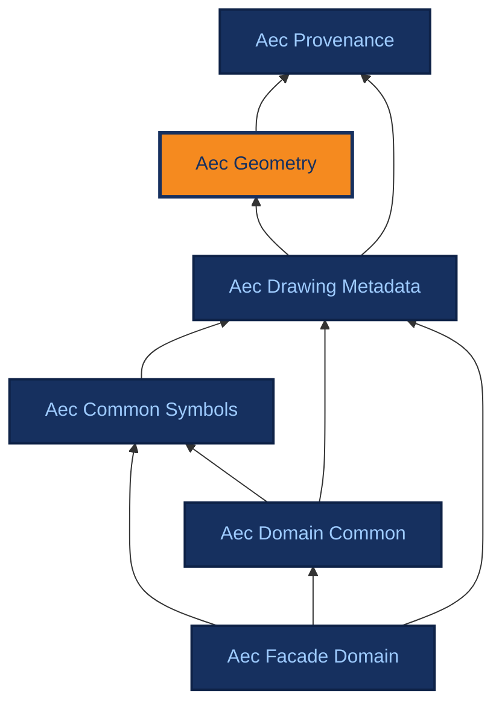

# Aec Geometry

[{ .ontocanvas-icon } Open in OntoCanvas](https://alelom.github.io/OntoCanvas/?onto=https://burohappoldmachinelearning.github.io/ADIRO/aec_geometry.html){ .md-button target=_blank }
[:material-file-document-outline: TTL source](https://burohappoldmachinelearning.github.io/ADIRO/aec_geometry.ttl){ .md-button }
[:material-file-code: pyLODE HTML](https://burohappoldmachinelearning.github.io/ADIRO/aec_geometry.html){ .md-button }

Foundational, domain-neutral vocabulary for locating a detection on a drawing page: a BoundingBox (the shape) interpreted against a CoordinateFrame (which PDF/page, units, origin and axes). A bounding box is modelled as a first-class, provenance-bearing individual - an aec_provenance:InferredEntity - so a box records what produced it (a detector or a human) and with what confidence, independently of the confidence in any value read at that box. GeoSPARQL's geo:Geometry is reused as the shape supertype. Imported by the drawing modules (e.g. aec_drawing_metadata), which attach frames to sheets and boxes to assertions. Shared across use cases: UC-01 (title-block field regions) and UC-03 (reference-symbol geometry) use the same BoundingBox / CoordinateFrame model.

- **IRI:** `https://w3id.org/adiro/aec_geometry`
- **Version:** 1.0.0
- **Imports:** `aec_provenance`

## Dependencies

Arrows point from an ontology to the ontologies it imports; the current ontology is highlighted.

## Classes

### Bounding Box {#BoundingBox}

A rectangular region on a drawing page that locates something detected there - e.g. a title-block field's caption or value. Its coordinates are held as an xyxy string (bboxXYXY) and are meaningless without the CoordinateFrame it points at (inCoordinateFrame), which fixes the unit, coordinate space, origin, axes, page and exact PDF. A BoundingBox is itself an InferredEntity: it carries its own provenance (aprov:hasInferenceMeta - a detector, or a human annotator) and its own confidence (aprov:hasConfidence, the detector score), which is DISTINCT from the confidence in a value read at that box. A subclass of GeoSPARQL geo:Geometry so it is recognised as a spatial shape.

- **IRI:** `https://w3id.org/adiro/aec_geometry#BoundingBox`
- **Sub class of:**
    - [Geometry](#Geometry)
    - `aprov:InferredEntity`

### Coordinate Frame {#CoordinateFrame}

The coordinate context that makes a geometry's numbers interpretable: which exact PDF and page they are relative to, in what unit, and under which named coordinate space. The named space fixes the reference point (origin) and axis directions - the primary space page_display_pt means a top-left origin with x increasing rightwards and y increasing downwards, in points - so origin and axes are carried by coordinateSpace/profileRef rather than as loose fields. A frame is normally owned by a DrawingSheet (aec_drawing_metadata:hasCoordinateFrame) and shared by all geometries on that page; a sheet may have different frames in different file versions. Not an InferredEntity: a frame is a declared coordinate context, not a detection carrying its own confidence.

- **IRI:** `https://w3id.org/adiro/aec_geometry#CoordinateFrame`

### Geometry {#Geometry}

Local typing stub for GeoSPARQL's Geometry class (authoritative definition at the rdfs:isDefinedBy IRI), declared here so reasoning stays offline. Used as the supertype of BoundingBox so an ADIRO box is recognised as a spatial shape; ADIRO adopts no GeoSPARQL CRS or spatial-query profile (deferred, GitHub issue #36).

- **IRI:** `http://www.opengis.net/ont/geosparql#Geometry`

## Object Properties

### hasBoundingBox {#hasBoundingBox}

The bounding box that locates a region on a drawing page. In UC-01 this is the title block's own region (aec_drawing_metadata:Titleblock hasBoundingBox ...): the field values are read from within that single region and are not themselves individually localised. No rdfs:domain is asserted, so the same property serves any locatable region or element - e.g. UC-03 reference symbols, when that work extends this module.

- **IRI:** `https://w3id.org/adiro/aec_geometry#hasBoundingBox`
- **Range:** [Bounding Box](#BoundingBox)

### inCoordinateFrame {#inCoordinateFrame}

The CoordinateFrame that interprets this geometry's coordinates. Required for a geometry to mean anything: the same xyxy numbers denote different regions in different frames, so equal coordinates alone never establish that two geometries are the same region.

- **IRI:** `https://w3id.org/adiro/aec_geometry#inCoordinateFrame`
- **Domain:** [Geometry](#Geometry)
- **Range:** [Coordinate Frame](#CoordinateFrame)

## Datatype Properties

### bboxXYXY {#bboxXYXY}

The rectangle as a string "[xmin, ymin, xmax, ymax]" in the coordinate frame's convention (xmin/ymin the top-left corner, xmax/ymax the bottom-right, under page_display_pt). The xyxy ordering is aligned to the Croissant cr:BoundingBox 'XYXY' format token, so an ADIRO box can be mapped to Croissant/CV formats by an exporter - ADIRO stores a page-point xyxy string, whereas Croissant expects a four-number array with a format declaration (see docs/design-decisions/croissant-comparison.md). Interpret only together with inCoordinateFrame.

- **IRI:** `https://w3id.org/adiro/aec_geometry#bboxXYXY`
- **Domain:** [Bounding Box](#BoundingBox)
- **Range:** `xsd:string`

### coordinateSpace {#coordinateSpace}

The named coordinate convention that fixes the origin and axes. Primary: 'page_display_pt' - top-left origin, x rightwards, y downwards, in points. Native PDF user space and rendered-image pixels are different spaces and must be named as such; do not interchange the names.

- **IRI:** `https://w3id.org/adiro/aec_geometry#coordinateSpace`
- **Domain:** [Coordinate Frame](#CoordinateFrame)
- **Range:** `xsd:string`

### displayHeightPt {#displayHeightPt}

Effective display-page height in points after the recorded page mapping; supports bounds checks on coordinates.

- **IRI:** `https://w3id.org/adiro/aec_geometry#displayHeightPt`
- **Domain:** [Coordinate Frame](#CoordinateFrame)
- **Range:** `xsd:decimal`

### displayWidthPt {#displayWidthPt}

Effective display-page width in points after the recorded page mapping; supports bounds checks on coordinates.

- **IRI:** `https://w3id.org/adiro/aec_geometry#displayWidthPt`
- **Domain:** [Coordinate Frame](#CoordinateFrame)
- **Range:** `xsd:decimal`

### frameArtifactRef {#frameArtifactRef}

A reference (e.g. a manifest key or content hash) pinning the exact PDF/artifact version the coordinates are relative to, so a frame is tied to a specific file and not merely a page number.

- **IRI:** `https://w3id.org/adiro/aec_geometry#frameArtifactRef`
- **Domain:** [Coordinate Frame](#CoordinateFrame)
- **Range:** `xsd:string`

### pageIndex {#pageIndex}

Zero-based index of the page within the referenced PDF that this frame describes.

- **IRI:** `https://w3id.org/adiro/aec_geometry#pageIndex`
- **Domain:** [Coordinate Frame](#CoordinateFrame)
- **Range:** `xsd:nonNegativeInteger`

### pdfRotationDeg {#pdfRotationDeg}

Effective PDF page rotation metadata for the referenced page. The primary page_display_pt coordinates already include the recorded page mapping, so this is for interpretation/validation - do not apply the rotation to the coordinates again.

- **IRI:** `https://w3id.org/adiro/aec_geometry#pdfRotationDeg`
- **Domain:** [Coordinate Frame](#CoordinateFrame)
- **Range:** `xsd:integer`

### profileRef {#profileRef}

Reference to the versioned coordinate profile that defines the named coordinateSpace in full (origin, axes, unit and effective page extent), so the convention is pinned rather than only implied by the space's name.

- **IRI:** `https://w3id.org/adiro/aec_geometry#profileRef`
- **Domain:** [Coordinate Frame](#CoordinateFrame)
- **Range:** `xsd:string`

### unit {#unit}

The unit of the coordinate values: 'pt' for the primary page_display_pt space (1 pt = 1/72 inch), 'px' for raster/pixel evidence. Display-page coordinates in pt are independent of rendering DPI.

- **IRI:** `https://w3id.org/adiro/aec_geometry#unit`
- **Domain:** [Coordinate Frame](#CoordinateFrame)
- **Range:** `xsd:string`
