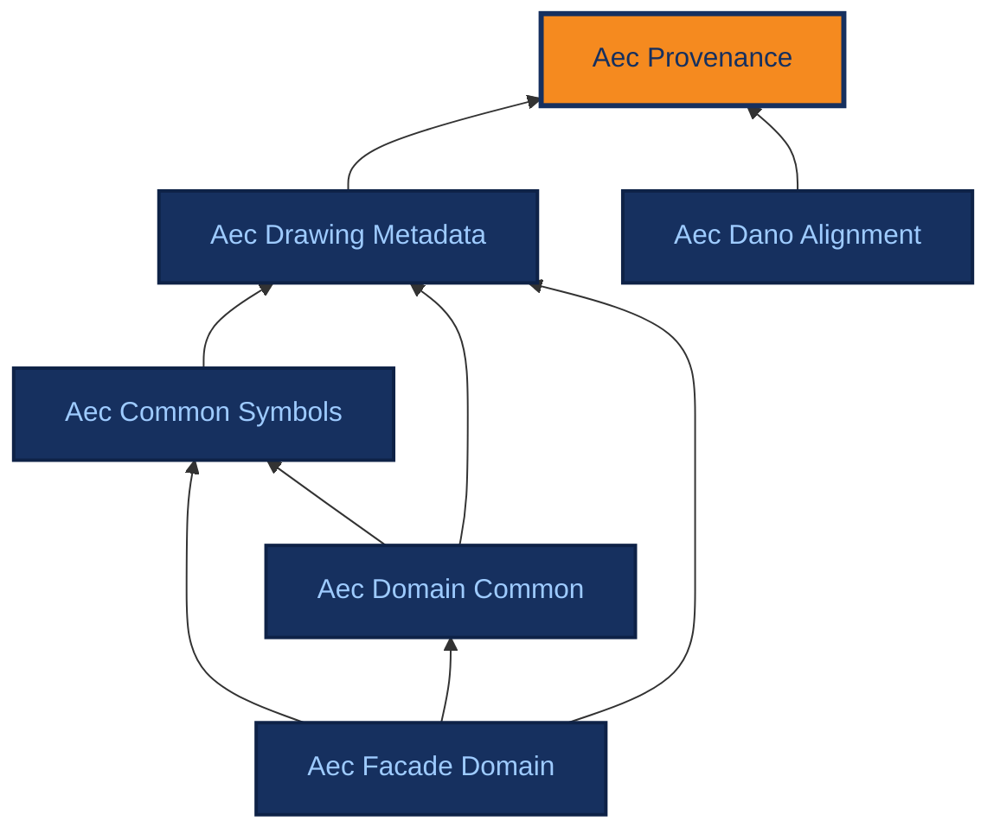

# Aec Provenance

[{ .ontocanvas-icon } Open in OntoCanvas](https://alelom.github.io/OntoCanvas/?onto=https://burohappoldmachinelearning.github.io/ADIRO/aec_provenance.html){ .md-button target=_blank }
[:material-file-document-outline: TTL source](https://burohappoldmachinelearning.github.io/ADIRO/aec_provenance.ttl){ .md-button }
[:material-file-code: pyLODE HTML](https://burohappoldmachinelearning.github.io/ADIRO/aec_provenance.html){ .md-button }

Foundational, domain-neutral vocabulary for representing an inferred/extracted assertion together with its provenance and confidence. It exists so that a value read off a drawing (a title-block field, a detected symbol, ...) can be modelled as a first-class assertion carrying: which region asserted it, what produced it, from where, when, and with what confidence - independently of the value itself. Imported by the drawing modules (e.g. aec_drawing_metadata); aligned to W3C PROV-O for interoperability.

- **IRI:** `https://w3id.org/adiro/aec_provenance`
- **Version:** 1.0.0

## Dependencies

Arrows point from an ontology to the ontologies it imports; the current ontology is highlighted.

## Classes

### Activity {#Activity}

Typing stub for the PROV-O term of the same name, declared locally so this module stays self-contained and the reasoning CI resolves offline. A stub is a name, not a definition: the authoritative axioms live at the source that rdfs:isDefinedBy points at. Disjoint with prov:Entity in PROV-O - see prov:Entity above.

- **IRI:** `http://www.w3.org/ns/prov#Activity`

### Agent {#Agent}

Typing stub for the PROV-O term of the same name, declared locally so this module stays self-contained and the reasoning CI resolves offline. A stub is a name, not a definition: the authoritative axioms live at the source that rdfs:isDefinedBy points at.

- **IRI:** `http://www.w3.org/ns/prov#Agent`

### Entity {#Entity}

Typing stub for the PROV-O term of the same name, declared locally so this module stays self-contained and the reasoning CI resolves offline. A stub is a name, not a definition: the authoritative axioms live at the source that rdfs:isDefinedBy points at. PROV-O declares prov:Entity owl:disjointWith prov:Activity, which is why the alignment below is seated carefully: a FieldAssertion is the Entity produced, an InferenceMeta is the Activity that produced it, and nothing may be both.

- **IRI:** `http://www.w3.org/ns/prov#Entity`

### Field Assertion {#FieldAssertion}

A single reified assertion that some source makes a value-claim about a field kind. Reifying the claim (rather than attaching the value straight to a subject) lets each printed occurrence carry its own provenance - which region asserted it (assertedBy), what produced it (hasInferenceMeta), and with what confidence (hasConfidence) - independently of the value it states. The value is a literal (hasLiteralValue) for datatype-valued fields or an entity (hasValueEntity) for object-valued fields. Validated assertions are promoted to direct statements on the subject downstream; conflicting assertions across sources are surfaced, not silently merged. In PROV-O terms this is the prov:Entity an extraction produced, which is why the PROV alignment is seated across two classes rather than all on one.

- **IRI:** `https://w3id.org/adiro/aec_provenance#FieldAssertion`
- **Sub class of:** [Entity](#Entity)

### Inference Meta {#InferenceMeta}

Provenance metadata for an inferred or extracted assertion: what produced it (inferredBy / inferredWith), the source it was derived from (inferredFrom), and when (inferredAt). Modelled as a separate object so several assertions can share one inference record and so provenance can be added without touching the value. Analogous to DANO's DrawingElementMeta, but aligned to PROV-O: this is the prov:Activity that produced the assertion, NOT a prov:Entity. PROV-O declares those two owl:disjointWith, so the distinction is load-bearing rather than stylistic.

- **IRI:** `https://w3id.org/adiro/aec_provenance#InferenceMeta`
- **Sub class of:** [Activity](#Activity)

## Object Properties

### assertedAbout {#assertedAbout}

The subject the claim is ABOUT - the thing a validated assertion is promoted onto. Distinct from assertedBy, which records where the claim was read FROM: a drawn-by name is read from a title-block region (assertedBy) but is a claim about a particular DrawingRevision (assertedAbout), and a sheet has many revisions, so the subject cannot be recovered from the region alone. Without it, mapsToFieldProperty names a property but nothing names the individual to hang it on, and promotion is not expressible. No rdfs:range is asserted: the subjects differ per field kind - Titleblock, DrawingSheet, DrawingRevision, DrawingPackage, Project - and a narrower range would entail those subjects are of a type they are not.

- **IRI:** `https://w3id.org/adiro/aec_provenance#assertedAbout`
- **Domain:** [Field Assertion](#FieldAssertion)

### assertedBy {#assertedBy}

The source that makes this assertion - typically the drawing region it was read from (e.g. a Titleblock or a Layout). This is the provenance that lets the same field kind asserted by different regions be distinguished (e.g. a sheet-level scale in the title block versus a per-layout scale in a layout corner), which a fixed domain on a per-field property cannot express.

- **IRI:** `https://w3id.org/adiro/aec_provenance#assertedBy`
- **Domain:** [Field Assertion](#FieldAssertion)

### assertsFieldKind {#assertsFieldKind}

The field kind (a SKOS concept in a field-kind scheme, e.g. a title-block field such as Scale or Client) that this assertion is about. Keeping the kind as a referenced concept - rather than a bespoke property per field - is what lets names/synonyms live on the concept and keeps the number of relationships small.

- **IRI:** `https://w3id.org/adiro/aec_provenance#assertsFieldKind`
- **Domain:** [Field Assertion](#FieldAssertion)
- **Range:** `skos:Concept`

### hasInferenceMeta {#hasInferenceMeta}

Links an assertion to the InferenceMeta describing what produced it, from where, and when. Aligned to prov:wasGeneratedBy: the assertion (a prov:Entity) was generated by the inference (a prov:Activity).

- **IRI:** `https://w3id.org/adiro/aec_provenance#hasInferenceMeta`
- **Sub property of:** [wasGeneratedBy](#wasGeneratedBy)
- **Domain:** [Field Assertion](#FieldAssertion)
- **Range:** [Inference Meta](#InferenceMeta)

### hasValueEntity {#hasValueEntity}

For object-valued field kinds, the entity that is the asserted value - e.g. a Person or Organisation. Used instead of hasLiteralValue when the field references a thing rather than states a string, which is what makes cross-sheet questions ('everything checked by X') answerable.

- **IRI:** `https://w3id.org/adiro/aec_provenance#hasValueEntity`
- **Domain:** [Field Assertion](#FieldAssertion)

### inferredBy {#inferredBy}

The actor, organisation or software that produced this inference. Aligned to prov:wasAssociatedWith - the agent the inference activity was associated with.

- **IRI:** `https://w3id.org/adiro/aec_provenance#inferredBy`
- **Sub property of:** [wasAssociatedWith](#wasAssociatedWith)
- **Domain:** [Inference Meta](#InferenceMeta)
- **Range:** [Agent](#Agent)

### inferredFrom {#inferredFrom}

The source the value was derived from - e.g. the origin file, page or region. Aligned to prov:used - the activity used this source.

- **IRI:** `https://w3id.org/adiro/aec_provenance#inferredFrom`
- **Sub property of:** [used](#used)
- **Domain:** [Inference Meta](#InferenceMeta)

### inferredWith {#inferredWith}

The algorithm or model (ideally with version) used to produce this inference. Distinct from inferredBy, which names the responsible actor; inferredWith names the tool. Aligned to prov:used - the activity used this model.

- **IRI:** `https://w3id.org/adiro/aec_provenance#inferredWith`
- **Sub property of:** [used](#used)
- **Domain:** [Inference Meta](#InferenceMeta)

### used {#used}

Typing stub for the PROV-O term of the same name, declared locally so this module stays self-contained and the reasoning CI resolves offline. A stub is a name, not a definition: the authoritative axioms live at the source that rdfs:isDefinedBy points at. (rdfs:domain prov:Activity, rdfs:range prov:Entity)

- **IRI:** `http://www.w3.org/ns/prov#used`

### wasAssociatedWith {#wasAssociatedWith}

Typing stub for the PROV-O term of the same name, declared locally so this module stays self-contained and the reasoning CI resolves offline. A stub is a name, not a definition: the authoritative axioms live at the source that rdfs:isDefinedBy points at. (rdfs:domain prov:Activity, rdfs:range prov:Agent)

- **IRI:** `http://www.w3.org/ns/prov#wasAssociatedWith`

### wasGeneratedBy {#wasGeneratedBy}

Typing stub for the PROV-O term of the same name, declared locally so this module stays self-contained and the reasoning CI resolves offline. A stub is a name, not a definition: the authoritative axioms live at the source that rdfs:isDefinedBy points at. (rdfs:domain prov:Entity, rdfs:range prov:Activity)

- **IRI:** `http://www.w3.org/ns/prov#wasGeneratedBy`

## Datatype Properties

### capturedCaption {#capturedCaption}

The caption/label text exactly as printed on the drawing for this assertion (e.g. 'Verfasser', 'Dwg. Desc.'). Retained even when the field kind is uncertain, so the ground truth of what was on the sheet is never lost and mapping can be revisited later.

- **IRI:** `https://w3id.org/adiro/aec_provenance#capturedCaption`
- **Domain:** [Field Assertion](#FieldAssertion)
- **Range:** `xsd:string`

### endedAtTime {#endedAtTime}

Typing stub for the PROV-O term of the same name, declared locally so this module stays self-contained and the reasoning CI resolves offline. A stub is a name, not a definition: the authoritative axioms live at the source that rdfs:isDefinedBy points at. (rdfs:domain prov:Activity, rdfs:range xsd:dateTime). ADIRO's own :inferredAt declares rdfs:range xsd:dateTime, so the precision is asserted where it belongs - on the term this suite owns.

- **IRI:** `http://www.w3.org/ns/prov#endedAtTime`

### hasConfidence {#hasConfidence}

Confidence of the inference behind this assertion, as a decimal in [0,1]. Carried on the assertion (an individual) rather than on a triple, which keeps confidence in the graph without requiring RDF-star or statement reification.

- **IRI:** `https://w3id.org/adiro/aec_provenance#hasConfidence`
- **Domain:** [Field Assertion](#FieldAssertion)
- **Range:** `xsd:decimal`

### hasLiteralValue {#hasLiteralValue}

For datatype-valued field kinds, the literal value asserted, kept verbatim (not normalised, expanded or translated at extraction time).

- **IRI:** `https://w3id.org/adiro/aec_provenance#hasLiteralValue`
- **Domain:** [Field Assertion](#FieldAssertion)
- **Range:** `rdfs:Literal`

### inferredAt {#inferredAt}

The time the inference was produced. Aligned to prov:endedAtTime - when the inference activity ended.

- **IRI:** `https://w3id.org/adiro/aec_provenance#inferredAt`
- **Sub property of:** [endedAtTime](#endedAtTime)
- **Domain:** [Inference Meta](#InferenceMeta)
- **Range:** `xsd:dateTime`

## Annotation Properties

### expectedRange {#expectedRange}

On a field-kind concept: the expected type of its asserted value - a datatype (e.g. xsd:string, xsd:date) for literal-valued fields, or a class (e.g. Person, Organisation) for object-valued fields. Signals whether an assertion of this kind uses hasLiteralValue or hasValueEntity.

- **IRI:** `https://w3id.org/adiro/aec_provenance#expectedRange`

### mapsToFieldProperty {#mapsToFieldProperty}

On a field-kind concept: the canonical ADIRO property that a validated assertion of this field kind is promoted to (the bridge from the reified assertion to a direct statement on the subject). The subject is the assertion's assertedAbout, so a promotion is: ?a assertedAbout ?subject ; assertsFieldKind ?k . ?k mapsToFieldProperty ?p  =>  ?subject ?p <value>. Annotation only - the promotion is performed by tooling on validation, not by reasoning.

- **IRI:** `https://w3id.org/adiro/aec_provenance#mapsToFieldProperty`
