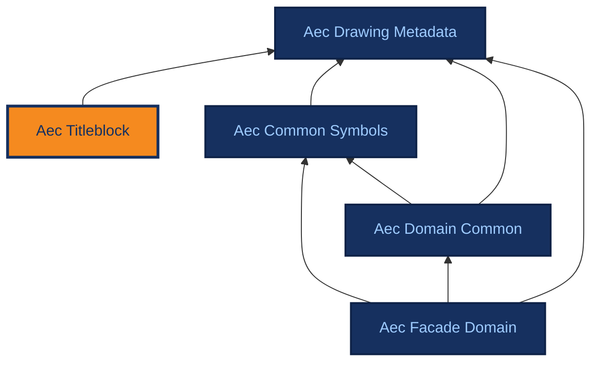

# Aec Titleblock

[{ .ontocanvas-icon } Open in OntoCanvas](https://alelom.github.io/OntoCanvas/?onto=https://burohappoldmachinelearning.github.io/ADIRO/aec_titleblock.html){ .md-button target=_blank }
[:material-file-document-outline: TTL source](https://burohappoldmachinelearning.github.io/ADIRO/aec_titleblock.ttl){ .md-button }
[:material-file-code: pyLODE HTML](https://burohappoldmachinelearning.github.io/ADIRO/aec_titleblock.html){ .md-button }

What a title block asserts: the content fields printed in the titleblock region of an AEC drawing sheet, bound to ISO 7200 / ISO 19650 / DIN 1356-1 concepts. Complements aec_drawing_metadata, which models the titleblock as a detectable graphical region.

- **IRI:** `https://w3id.org/adiro/aec_titleblock`
- **Version:** 0.1.0
- **Imports:** `aec_drawing_metadata`

## Dependencies

Arrows point from an ontology to the ontologies it imports; the current ontology is highlighted.

## Classes

### Document Type {#DocumentType}

The kind of drawing, as a concept in a controlled vocabulary: DIN 1356-1 Planart values (design stage) plus ISO 19650-2 type codes. NOT the same axis as dm:LayoutContentType, which classifies the view (Plan / Section / Elevation / Detail / Table / Perspective). A single sheet has one document type and may contain several layouts of differing content type. Concept individuals are added in a later pass.

- **IRI:** `https://w3id.org/adiro/aec_titleblock#DocumentType`
- **Sub class of:** `skos:Concept`

### Organization {#Organization}

A legal entity named in a title block — client, originator, legal owner or responsible department. Modelled as a class rather than a string so that one organisation recurring across many sheets is a single individual, which is what makes cross-sheet questions answerable. Aligns to ct:Organisation (ISO 21597-1) and IfcActorSelect; note the ISO spelling differs.

- **IRI:** `https://w3id.org/adiro/aec_titleblock#Organization`

## Object Properties

### asserts metadata for {#assertsMetadataFor}

Links a titleblock region to the drawing sheet whose metadata it asserts. The separation matters because a value read from a titleblock is a claim, not a fact: two sheets can assert conflicting values for one document, and a claim must be validated before it is promoted. Range is dm:DrawingSheet rather than a separate Document class: the sheet is the unit UC-01 established as searchable, and introducing a competing Document class would deepen an unresolved placement question rather than settle it.

- **IRI:** `https://w3id.org/adiro/aec_titleblock#assertsMetadataFor`
- **Domain:** `dm:Titleblock`
- **Range:** `dm:DrawingSheet`
- **extraction hint:** Not extracted. Asserted by the pipeline when a titleblock region is detected on a sheet.

### has client {#hasClient}

The client or employer commissioning the work, as named in the title block. Universal on AEC title blocks and, notably, absent from ISO 7200, which provides only a legal-owner field. Distinct from hasLegalOwner (who owns the document) and hasOriginator (who produced the file); on an in-house drawing all three may print the same name, which is why each is separately named here.

- **IRI:** `https://w3id.org/adiro/aec_titleblock#hasClient`
- **Domain:** `dm:Titleblock`
- **Range:** [Organization](#Organization)
- **extraction hint:** Often the most prominent organisation name on the sheet, sometimes a logo rather than text. Frequently in its own cell above or beside the originator's block.

### has document type {#hasDocumentType}

The kind of drawing asserted by the title block — DIN 1356-1 Planart or an ISO 19650-2 type code. Read the DocumentType comment before binding: this is design stage and document kind, not the view type carried by dm:LayoutContentType.

- **IRI:** `https://w3id.org/adiro/aec_titleblock#hasDocumentType`
- **Domain:** `dm:Titleblock`
- **Range:** [Document Type](#DocumentType)
- **extraction hint:** On German sheets a labelled 'Planart' cell. On UK sheets often absent as a field and encoded instead in the drawing-number type segment.

### has legal owner {#hasLegalOwner}

The organisation legally owning the document, per ISO 7200:2004 §5.1.2 (a mandatory field in that standard). Distinct from hasClient: the owner of the document is not necessarily the party who commissioned the work. Distinct from hasOriginator: ownership is not authorship.

- **IRI:** `https://w3id.org/adiro/aec_titleblock#hasLegalOwner`
- **Domain:** `dm:Titleblock`
- **Range:** [Organization](#Organization)
- **extraction hint:** Often appears as a copyright line or ownership statement rather than a labelled cell, sometimes in small print at the edge of the block.

### has originator {#hasOriginator}

The organisation that produced the drawing — the originator in ISO 19650-2 terms, and one segment of the information-container identifier. Distinct from hasLegalOwner and hasClient. This is the practice or consultancy whose name and logo appear as author of the sheet.

- **IRI:** `https://w3id.org/adiro/aec_titleblock#hasOriginator`
- **Domain:** `dm:Titleblock`
- **Range:** [Organization](#Organization)
- **extraction hint:** Usually the organisation whose logo sits in or beside the title block, and whose code appears in the drawing-number originator segment.

## Datatype Properties

### dimensionUnits {#dimensionUnits}

The units in which the drawing's dimensions are expressed, where the title block states them alongside the scale. German practice per DIN 1356-1 writes both together, as in '1:50 – m,cm'. Held separately from the scale so the scale value stays parseable as a ratio.

- **IRI:** `https://w3id.org/adiro/aec_titleblock#dimensionUnits`
- **Domain:** `dm:Titleblock`
- **Range:** `xsd:string`
- **extraction hint:** Appears beside or beneath the scale, often after a dash. Extract only the unit part; the ratio belongs to the scale field.

### numberOfSheets {#numberOfSheets}

How many sheets the document comprises, per ISO 7200:2004 §5.1.7 (optional in that standard). Read together with sheetNumber from a single printed phrase.

- **IRI:** `https://w3id.org/adiro/aec_titleblock#numberOfSheets`
- **Domain:** `dm:Titleblock`
- **Range:** `xsd:integer`
- **extraction hint:** The second number in 'Sheet 3 of 7'. Omit the property if the sheet does not state a total.

### organizationName {#organizationName}

The name of an organisation as printed. Parallels dm:personName. Verbatim: not normalised, expanded or translated at extraction time.

- **IRI:** `https://w3id.org/adiro/aec_titleblock#organizationName`
- **Domain:** [Organization](#Organization)
- **Range:** `xsd:string`
- **extraction hint:** Transcribe exactly as printed, including any legal suffix.

### planKey {#planKey}

The composite coded identifier printed in the title block (Plankopf), as expected by DIN SPEC 91391-1. Stored whole and verbatim; its segments are obtained by parsing rather than by separate extraction. Valuable beyond identification: DIN SPEC 91391-1 expects the plan key to agree with the file name, which gives a consistency check runnable over an entire corpus without any annotation.

- **IRI:** `https://w3id.org/adiro/aec_titleblock#planKey`
- **Domain:** `dm:Titleblock`
- **Range:** `xsd:string`
- **extraction hint:** A long hyphen- or dot-separated code, usually the most structured string in the block. Capture the whole string; do not split it.

### sheetNumber {#sheetNumber}

Which sheet this is within a multi-sheet document, per ISO 7200:2004 §5.1.6 (mandatory in that standard). A string rather than an integer because forms such as '3a' occur. Distinct from dm:drawingIdentifier, which identifies the sheet itself rather than its position in a set.

- **IRI:** `https://w3id.org/adiro/aec_titleblock#sheetNumber`
- **Domain:** `dm:Titleblock`
- **Range:** `xsd:string`
- **extraction hint:** Usually printed as 'Sheet 3 of 7' or 'Blatt 3 von 7'; capture only the position here and the total in numberOfSheets.

### supplementaryTitle {#supplementaryTitle}

A secondary or qualifying title line, per ISO 7200:2004 §5.2.3 (optional in that standard). Distinct from the main title: AEC title blocks commonly stack two or three title lines, of which the first is the subject and the rest narrow it. Language-tagged because bilingual title blocks are normal on German projects.

- **IRI:** `https://w3id.org/adiro/aec_titleblock#supplementaryTitle`
- **Domain:** `dm:Titleblock`
- **Range:** `rdf:langString`
- **extraction hint:** The second and subsequent lines of a stacked title cell. Keep line order; do not concatenate into the main title.

## Annotation Properties

### extraction hint {#extractionHint}

Free-text guidance for an information-extraction model on where and how a field typically appears in a title block (adjacent captions, cell grouping, formatting). Consumed by the generated extraction profile, not by reasoning.

- **IRI:** `https://w3id.org/adiro/aec_titleblock#extractionHint`
- **Range:** `xsd:string`
