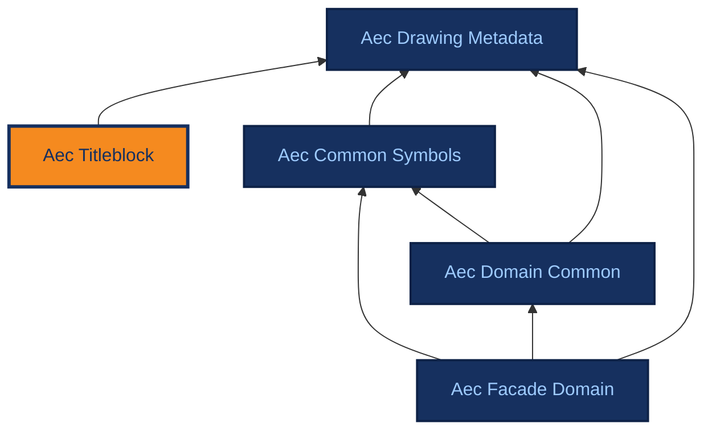

# Aec Titleblock

[{ .ontocanvas-icon } Open in OntoCanvas](https://alelom.github.io/OntoCanvas/?onto=https://burohappoldmachinelearning.github.io/ADIRO/aec_titleblock.html){ .md-button target=_blank }
[:material-file-document-outline: TTL source](https://burohappoldmachinelearning.github.io/ADIRO/aec_titleblock.ttl){ .md-button }
[:material-file-code: pyLODE HTML](https://burohappoldmachinelearning.github.io/ADIRO/aec_titleblock.html){ .md-button }

Retired placeholder. Every term formerly declared here was relocated to aec_drawing_metadata on 2026-09-14 by team decision, that module being the single repository for drawing metadata. This file declares no terms and is retained only for its record of vocabulary considered and rejected; whether it should be deleted outright is an open question.

- **IRI:** `https://w3id.org/adiro/aec_titleblock`
- **Version:** 0.1.0
- **Imports:** `aec_drawing_metadata`
## Dependencies

Arrows point from an ontology to the ontologies it imports; the current ontology is highlighted.

