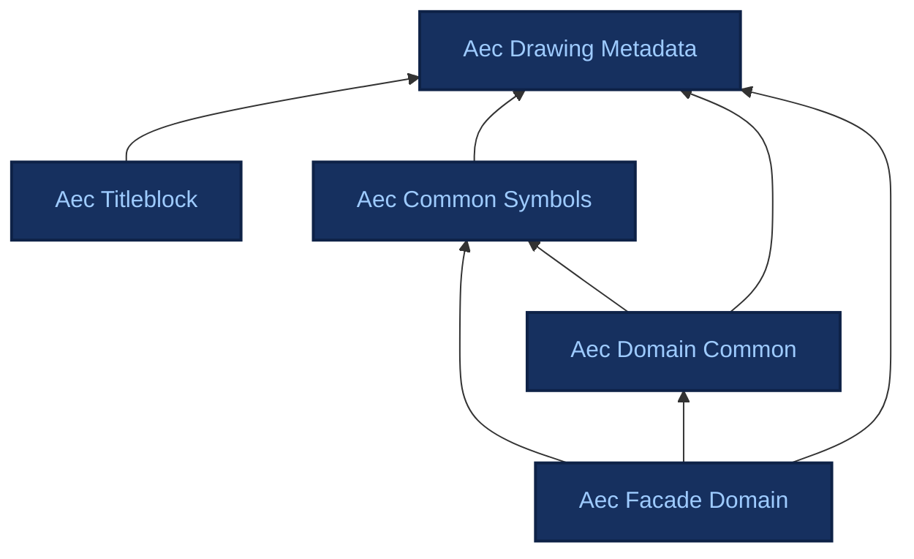

# Ontologies

Reference documentation for each ADIRO ontology, generated from the Turtle sources. Each page also links to an interactive HTML view (pyLODE) and to OntoCanvas.

## Dependencies

The ADIRO ontologies are modular and build on one another via `owl:imports`. Arrows point from an ontology to the ontologies it imports.

## Available ontologies

-   ### [Aec Drawing Metadata](aec_drawing_metadata.md)

    Sheet/layout/document structure for AEC drawings.

-   ### [Aec Titleblock](aec_titleblock.md)

    What a title block asserts: the content fields printed in the titleblock region of an AEC drawing sheet, bound to ISO 7200 / ISO 19650 / DIN 1356-1 concepts. Complements aec_drawing_metadata, which models the titleblock as a detectable graphical region.

    *Imports: aec_drawing_metadata*

-   ### [Aec Common Symbols](aec_common_symbols.md)

    Cross-discipline layout content. Generic symbol classes like dimensions, reference symbols, grids, etc. (mostly reusable non-domain symbols). All symbols are subclasses of DrawingElement from the drawing metadata ontology.

    *Imports: aec_drawing_metadata*

-   ### [Aec Domain Common](aec_domain_common.md)

    Shared domain abstractions reused across multiple domain ontologies (e.g., facade+structural).

    *Imports: aec_common_symbols, aec_drawing_metadata*

-   ### [Aec Facade Domain](aec_facade_domain.md)

    Facade-specific concepts and symbols for facade engineering drawings.

    *Imports: aec_common_symbols, aec_domain_common, aec_drawing_metadata*

