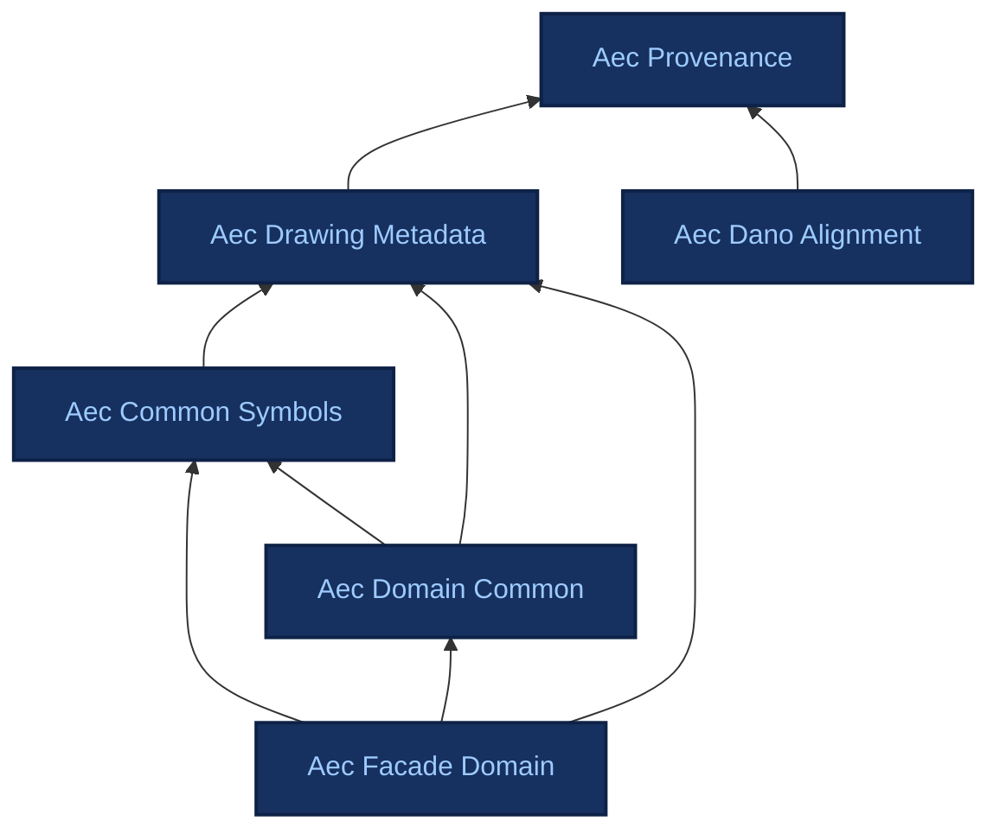

# Ontologies

Reference documentation for each ADIRO ontology, generated from the Turtle sources. Each page also links to an interactive HTML view (pyLODE) and to OntoCanvas.

## Dependencies

The ADIRO ontologies are modular and build on one another via `owl:imports`. Arrows point from an ontology to the ontologies it imports.

## Available ontologies

-   ### [Aec Provenance](aec_provenance.md)

    Foundational, domain-neutral vocabulary for representing an inferred/extracted assertion together with its provenance and confidence. It exists so that a value read off a drawing (a title-block field, a detected symbol, ...) can be modelled as a first-class assertion carrying: which region asserted it, what produced it, from where, when, and with what confidence - independently of the value itself. Imported by the drawing modules (e.g. aec_drawing_metadata); aligned to W3C PROV-O for interoperability.

-   ### [Aec Drawing Metadata](aec_drawing_metadata.md)

    Sheet/layout/document structure for AEC drawings.

    *Imports: aec_provenance*

-   ### [Aec Common Symbols](aec_common_symbols.md)

    Cross-discipline layout content. Generic symbol classes like dimensions, reference symbols, grids, etc. (mostly reusable non-domain symbols). All symbols are subclasses of DrawingElement from the drawing metadata ontology.

    *Imports: aec_drawing_metadata*

-   ### [Aec Domain Common](aec_domain_common.md)

    Shared domain abstractions reused across multiple domain ontologies (e.g., facade+structural).

    *Imports: aec_common_symbols, aec_drawing_metadata*

-   ### [Aec Facade Domain](aec_facade_domain.md)

    Facade-specific concepts and symbols for facade engineering drawings.

    *Imports: aec_common_symbols, aec_domain_common, aec_drawing_metadata*

-   ### [Aec Dano Alignment](aec_dano_alignment.md)

    OPTIONAL compatibility layer mapping ADIRO terms to the Drawing Analysis Ontology (DAnO, https://w3id.org/dano). Nothing in the ADIRO core imports this module and no ADIRO core module mentions DAnO, so a consumer who wants the DAnO crosswalk loads this file explicitly and everyone else never sees it. Every mapping is annotation-level (skos:closeMatch) and carries no logical force: no rdfs:subPropertyOf alignment to a DAnO term is available, and the DAnO IRIs are not declared here or anywhere else in ADIRO. Kept separate from the core for lifecycle reasons - DAnO has no releases, and an unreleased third-party vocabulary should not force a version bump on a module downstream consumers pin. Full rationale and per-term verdicts: https://burohappoldmachinelearning.github.io/ADIRO/design-decisions/dano-comparison/

    *Imports: aec_provenance*

