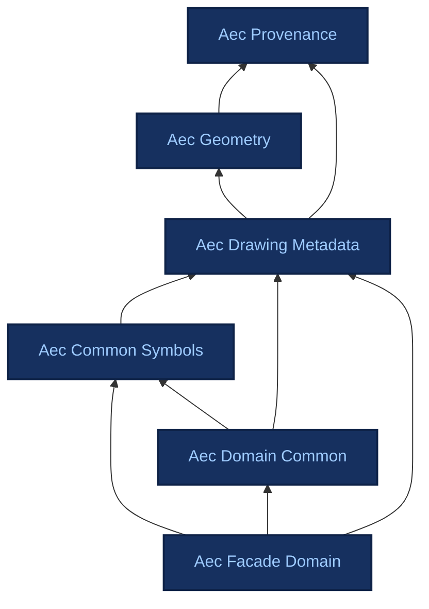

# Ontologies

Reference documentation for each ADIRO ontology, generated from the Turtle sources. Each page also links to an interactive HTML view (pyLODE) and to OntoCanvas.

## Dependencies

The ADIRO ontologies are modular and build on one another via `owl:imports`. Arrows point from an ontology to the ontologies it imports.

```mermaid
%%{init: {"themeCSS": ".base .nodeLabel,.base .nodeLabel p,.base text,.base tspan{fill:#9ecbff !important;color:#9ecbff !important}.current .nodeLabel,.current .nodeLabel p,.current text,.current tspan{fill:#16305f !important;color:#16305f !important}"} }%%
graph BT
    aec_provenance["Aec Provenance"]
    aec_geometry["Aec Geometry"]
    aec_drawing_metadata["Aec Drawing Metadata"]
    aec_common_symbols["Aec Common Symbols"]
    aec_domain_common["Aec Domain Common"]
    aec_facade_domain["Aec Facade Domain"]
    aec_geometry --> aec_provenance
    aec_drawing_metadata --> aec_geometry
    aec_drawing_metadata --> aec_provenance
    aec_common_symbols --> aec_drawing_metadata
    aec_domain_common --> aec_common_symbols
    aec_domain_common --> aec_drawing_metadata
    aec_facade_domain --> aec_common_symbols
    aec_facade_domain --> aec_domain_common
    aec_facade_domain --> aec_drawing_metadata
    click aec_provenance "aec_provenance/" "Aec Provenance reference page"
    click aec_geometry "aec_geometry/" "Aec Geometry reference page"
    click aec_drawing_metadata "aec_drawing_metadata/" "Aec Drawing Metadata reference page"
    click aec_common_symbols "aec_common_symbols/" "Aec Common Symbols reference page"
    click aec_domain_common "aec_domain_common/" "Aec Domain Common reference page"
    click aec_facade_domain "aec_facade_domain/" "Aec Facade Domain reference page"
    classDef base fill:#16305f,stroke:#0e2247,stroke-width:2px,color:#9ecbff;
    class aec_provenance,aec_geometry,aec_drawing_metadata,aec_common_symbols,aec_domain_common,aec_facade_domain base;
```

## Available ontologies

-   ### [Aec Provenance](aec_provenance.md)

    Foundational, domain-neutral module for provenance. It lets any value inferred from a drawing be recorded as an assertion that carries its own source, confidence, and how it was produced, aligned to W3C PROV-O. The drawing modules import it.

-   ### [Aec Geometry](aec_geometry.md)

    Foundational, domain-neutral module for geometry. It records where something sits on a drawing page as a bounding box, read against an explicit coordinate frame. Each box carries its own provenance and confidence. It reuses GeoSPARQL, is imported by the drawing modules, and is shared across use cases.

    *Imports: aec_provenance*

-   ### [Aec Drawing Metadata](aec_drawing_metadata.md)

    The core drawing vocabulary. It describes the structure of a drawing sheet: its layouts, title block, revisions, and the fields read from them. It imports the provenance and geometry modules, and the discipline modules build on it.

    *Imports: aec_geometry, aec_provenance*

-   ### [Aec Common Symbols](aec_common_symbols.md)

    Reusable symbols that appear across disciplines, such as dimensions, grids, levels, and reference symbols. Every symbol is a kind of drawing element from the drawing-metadata module. The discipline modules build on these shared symbols.

    *Imports: aec_drawing_metadata*

-   ### [Aec Domain Common](aec_domain_common.md)

    Concepts shared by several engineering domains. It sits between the common symbols and the discipline-specific modules, holding abstractions that more than one domain reuses, so they are defined once.

    *Imports: aec_common_symbols, aec_drawing_metadata*

-   ### [Aec Facade Domain](aec_facade_domain.md)

    Facade-engineering concepts and symbols, such as curtain-wall systems and glazing units. It is a discipline-specific module at the end of the dependency chain, building on the shared drawing, symbol, and domain vocabularies.

    *Imports: aec_common_symbols, aec_domain_common, aec_drawing_metadata*

