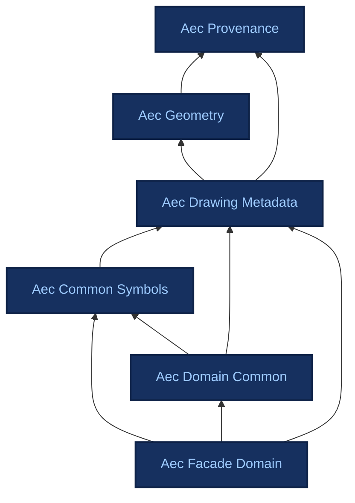

# Ontologies

Reference documentation for each ADIRO ontology, generated from the Turtle sources. Each page also links to an interactive HTML view (pyLODE) and to OntoCanvas.

## Dependencies

The ADIRO ontologies are modular and build on one another via `owl:imports`. Arrows point from an ontology to the ontologies it imports.

```mermaid
%%{init: {"themeCSS": ".base .nodeLabel,.base .nodeLabel p,.base text,.base tspan{fill:#9ecbff !important;color:#9ecbff !important}.current .nodeLabel,.current .nodeLabel p,.current text,.current tspan{fill:#16305f !important;color:#16305f !important}"} }%%
graph BT
    aec_provenance["Aec Provenance"]
    aec_geometry["Aec Geometry"]
    aec_drawing_metadata["Aec Drawing Metadata"]
    aec_common_symbols["Aec Common Symbols"]
    aec_domain_common["Aec Domain Common"]
    aec_facade_domain["Aec Facade Domain"]
    aec_geometry --> aec_provenance
    aec_drawing_metadata --> aec_geometry
    aec_drawing_metadata --> aec_provenance
    aec_common_symbols --> aec_drawing_metadata
    aec_domain_common --> aec_common_symbols
    aec_domain_common --> aec_drawing_metadata
    aec_facade_domain --> aec_common_symbols
    aec_facade_domain --> aec_domain_common
    aec_facade_domain --> aec_drawing_metadata
    click aec_provenance "aec_provenance/" "Aec Provenance reference page"
    click aec_geometry "aec_geometry/" "Aec Geometry reference page"
    click aec_drawing_metadata "aec_drawing_metadata/" "Aec Drawing Metadata reference page"
    click aec_common_symbols "aec_common_symbols/" "Aec Common Symbols reference page"
    click aec_domain_common "aec_domain_common/" "Aec Domain Common reference page"
    click aec_facade_domain "aec_facade_domain/" "Aec Facade Domain reference page"
    classDef base fill:#16305f,stroke:#0e2247,stroke-width:2px,color:#9ecbff;
    class aec_provenance,aec_geometry,aec_drawing_metadata,aec_common_symbols,aec_domain_common,aec_facade_domain base;
```

## Available ontologies

-   ### [Aec Provenance](aec_provenance.md)

    Foundational, domain-neutral vocabulary for representing an inferred/extracted assertion together with its provenance and confidence. It exists so that a value read off a drawing (a title-block field, a detected symbol, ...) can be modelled as a first-class assertion carrying: which region asserted it, what produced it, from where, when, and with what confidence - independently of the value itself. Imported by the drawing modules (e.g. aec_drawing_metadata); aligned to W3C PROV-O for interoperability.

-   ### [Aec Geometry](aec_geometry.md)

    Foundational, domain-neutral vocabulary for locating a detection on a drawing page: a BoundingBox (the shape) interpreted against a CoordinateFrame (which PDF/page, units, origin and axes). A bounding box is modelled as a first-class, provenance-bearing individual - an aec_provenance:InferredEntity - so a box records what produced it (a detector or a human) and with what confidence, independently of the confidence in any value read at that box. GeoSPARQL's geo:Geometry is reused as the shape supertype. Imported by the drawing modules (e.g. aec_drawing_metadata), which attach frames to sheets and boxes to assertions. Shared across use cases: UC-01 (title-block field regions) and UC-03 (reference-symbol geometry) use the same BoundingBox / CoordinateFrame model.

    *Imports: aec_provenance*

-   ### [Aec Drawing Metadata](aec_drawing_metadata.md)

    Sheet/layout/document structure for AEC drawings.

    *Imports: aec_geometry, aec_provenance*

-   ### [Aec Common Symbols](aec_common_symbols.md)

    Cross-discipline layout content. Generic symbol classes like dimensions, reference symbols, grids, etc. (mostly reusable non-domain symbols). All symbols are subclasses of DrawingElement from the drawing metadata ontology.

    *Imports: aec_drawing_metadata*

-   ### [Aec Domain Common](aec_domain_common.md)

    Shared domain abstractions reused across multiple domain ontologies (e.g., facade+structural).

    *Imports: aec_common_symbols, aec_drawing_metadata*

-   ### [Aec Facade Domain](aec_facade_domain.md)

    Facade-specific concepts and symbols for facade engineering drawings.

    *Imports: aec_common_symbols, aec_domain_common, aec_drawing_metadata*

